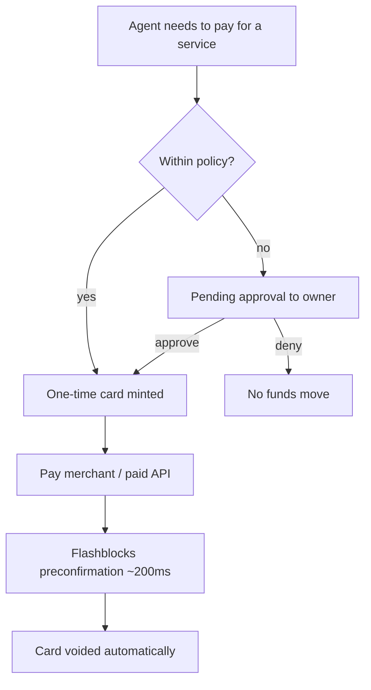

# GiwaCard - Plan

## Goal Capsule

- **Objective:** Win the GASOK grant by building crypto-native payment infrastructure for AI agents on GIWA Sepolia (chain ID 91342), inspired by the agentcard.sh model.
- **Product authority:** Lexirieru (repo owner). Product direction confirmed 2026-08-01: one-time onchain cards + a first merchant in the form of an x402-style paid API.
- **Open blockers:**
  - The extended GASOK deadline (31 July 2026) has already passed; the page does not yet state that it is closed. Submit the application as soon as possible, or contact the official email on the gasok page.

---

## Product Contract

### Summary

GiwaCard gives AI agents the ability to pay safely on GIWA Sepolia: the owner funds a smart account they own themselves, the agent mints one-time "cards" bounded by an amount cap, scope, and expiry through MCP + skill, and transactions outside policy are held until the owner approves them in the dashboard. The demo loop is closed by a first merchant in the form of an x402-style paid API that charges per request against that card.

### Problem Frame

AI agents are increasingly asked to complete workflows that end in a payment, but giving an agent full access to a wallet is an unacceptable risk — a single model mistake or prompt injection can drain the funds. agentcard.sh proved the solution in the fiat world: one-time virtual cards with caps, scope, and human approval. That product, however, is custodial and heavily US-centric (Visa, Apple Pay, face-scan KYC, a hardcoded San Francisco billing address), so the global crypto community cannot use it.

On the other side, GIWA — the OP Stack L2 belonging to the Upbit ecosystem — is looking for native applications through the GASOK program, and there is not yet any agent payment infrastructure at all on that chain. The raw materials are in fact already available at genesis: ERC-4337 EntryPoint v0.6/v0.7, Safe, Permit2, Flashblocks preconfirmation at ~200ms, and up.id identity.

### Key Decisions

- **Non-custodial.** Funds stay in the owner's smart account; the system never holds user keys or balances. A sharp differentiator from custodial agentcard.sh, which at the same time removes the need for KYC/compliance on testnet and becomes the main security narrative for the grant.
- **A card = a one-time onchain spend authorization.** A direct translation of the "one-time virtual card": an authorization with an amount cap, scope (token, merchant), and expiry that is voided after one successful charge. A leak of card credentials becomes worthless.
- **Policy is enforced in the contract, not in the prompt.** Caps and scope are enforced onchain so that a mistaken or compromised agent still cannot exceed the limits — the prompt is merely the layer of good manners, the contract is the layer of law.
- **Two-tier consent.** Out-of-policy requests produce a pending approval that the owner decides on (agentcard.sh's 202/approve pattern); on the client side, sensitive tools are held until explicit confirmation with the same signature call — mirroring the anti-prompt-injection pattern from imessage-agent-template.
- **Packaging as MCP server + skill.** The skill teaches the workflow and the safety rules; the MCP server executes. A <10-minute onboarding pattern from any coding agent is a product feature, not documentation.
- **The first merchant is built in-house as an x402-style paid API.** This avoids a simulated store: the end-to-end demo produces real value (an agent paying per request for a service) even though the chain is still testnet-only.
- **Testnet-first, sandbox-by-default.** GIWA Sepolia is the release target; mainnet goes on the grant roadmap (GIWA mainnet is not live yet). Mirrors agentcard.sh's sandbox-default pattern.
- **Contracts are upgradeable and verified.** All core contracts use an upgradeable proxy and are verified on Blockscout (sepolia-explorer.giwa.io) — an explicit constraint from the owner.
- **Dual-track grant strategy.** Register for GASOK on the AI/Web3 track (primary) and on GIWA-Native (Flashblocks, the 4337 predeploy, up.id as a load-bearing feature); the B2B platform is narrated as a Phase 3/4 roadmap.
- **Two equal usage paths: for human and for agent.** Humans use the interactive CLI and the dashboard; agents use MCP + skill. The core capabilities (view cards, approve, check balance) are available on both paths. The CLI is the primary human surface; the web dashboard is minimal (approval + status).
- **A single TypeScript stack** for all non-contract components (MCP SDK v2, viem, a clack-based CLI + ASCII art); contracts remain Foundry/Solidity. `npx giwacard` is the single entry point.
- **Card mechanism without an ERC-4337 bundler.** A card = a one-time EIP-712 authorization (the Permit2 SignatureTransfer pattern, unordered nonce bitmap) enforced by an onchain escrow vault; there is no bundler/paymaster dependency. 4337 compatibility is carried as roadmap, not MVP.
- **Fork the MIT-licensed code from the agentcard.sh reference repos** (MCP server, skill, redaction, approval patterns) with copyright attribution preserved; the entire onchain layer is written from scratch.
- **x402 settlement uses Permit2, which is already predeployed in the GIWA genesis**; a self-hosted facilitator becomes part of the paid API demo — with no EIP-3009 implementation.
- **The MCP server runs locally over stdio via npx for the MVP** — session keys never leave the owner's machine; remote HTTP mode becomes roadmap.
- **Onchain state is the single source of truth.** A card's used flag in the contract determines the final status; Flashblocks preconfirmation is used for "instant" UX, and the UI marks transactions as pending until the safe block.
- **One-command distribution.** The product installs from a public package registry with a single command (e.g. `npx giwacard`); its CLI is the onboarding entry point, with high-quality ASCII art as the brand identity in the terminal.

### Actors

- A1. **Owner** — the human who owns the funds; funds the smart account, sets the policy, approves/denies out-of-bounds requests.
- A2. **AI agent** — Claude Code / Cursor / Gemini CLI and the like, connected over MCP; requests cards and spends them on the owner's behalf.
- A3. **Merchant** — the recipient of the onchain payment; the first merchant is an x402-style paid API operated by this project.
- A4. **Dashboard** — the owner's web surface for balance, cards, approvals, and history; positioned as a candidate for GIWA Wallet integration.

### Requirements

**Onchain core**

- R1. The owner has a smart account on GIWA Sepolia that holds the test-stablecoin and ETH for gas.
- R2. The agent can request the issuance of a card with an amount cap, token, merchant scope, and expiry.
- R3. A card is one-time use: it is voided automatically after one successful charge and cannot be replayed.
- R3b. Minting a card escrows the cap from the available balance (available balance = balance minus the total caps of active cards); when a card is voided — spent, expired, or cancelled — the uncharged remainder becomes available again automatically.
- R4. Caps and scope are enforced at the contract level so that they cannot be exceeded by any agent.
- R5. Out-of-policy requests produce a pending approval that only the owner can resolve; without approval, no funds move.
- R5b. A pending approval expires automatically after a time limit into a deterministic terminal state, with no funds moving.
- R6. All core contracts are upgradeable and verified on the GIWA Sepolia Blockscout.

**Agent integration**

- R7. The MCP server exposes tools to the agent: mint a card, view card status, cancel a card, read the balance, read the policy, and check the status of its own approval requests — resolving an approval is NEVER available over MCP (owner-only via dashboard/CLI, consistent with R5).
- R8. The skill documents the workflow, the vocabulary, and the safety rules so that the agent uses the tools correctly.
- R9. A new coding agent can onboard (install MCP + skill through to the first card) in under 10 minutes by following a machine-executable runbook.
- R10. Secret material (session keys, card credentials) never enters the model context — it is redacted before tool results are returned.
- R10b. The charge to the merchant is executed server-side against an opaque card reference; the agent never receives material that can be signed.

**Owner surface**

- R11. The dashboard shows the balance, active/voided cards, the approval queue, and transaction history.
- R12. The owner can approve or deny a pending approval in at most two interactions from the dashboard.
- R13. The approval flow is designed to be self-contained and compact so that it is viable to integrate into GIWA Wallet (a GASOK selection criterion).

**Demo loop and ecosystem**

- R14. The first merchant is a paid API that charges per request through a card and returns a result of real value.
- R15. The end-to-end demo runs from the agent prompt through to the API result being received, with confirmation that feels instant via Flashblocks.
- R16. The test-stablecoin is deployed in-house, complete with its faucet (there is no canonical test USDC on GIWA Sepolia).

**Distribution and CLI**

- R19. The product installs via a single command from a public package registry (e.g. `npx giwacard` or the equivalent in the chosen stack's ecosystem).
- R20. The interactive CLI for humans covers onboarding (wizard), checking balance/cards, and resolving approvals — with high-quality ASCII art and smooth interaction as brand identity.
- R21. Documentation and entry points are split into "for human" (CLI + dashboard) and "for agent" (MCP + skill), with equivalent core capabilities in both.

**Grant deliverables**

- R17. The GASOK application material maps the product to the six Phase 1 criteria (GIWA fit, originality, feasibility, market, team, GIWA Wallet potential) for both the AI/Web3 and GIWA-Native tracks.
- R18. A public repo with a README that demonstrates the full flow and is ready to serve as demo video material.

### Key Flows

- F1. Owner onboarding
  - **Trigger:** A new owner wants to use GiwaCard.
  - **Actors:** A1, A4
  - **Steps:** Run the single-command CLI → an interactive wizard guides the way: connect wallet → set up the smart account → top up gas from the GIWA faucet and test-stablecoin from the project faucet → install MCP + skill in the agent → set the default policy.
  - **Outcome:** The agent is ready to spend funds within the policy limits.
- F2. Spending within policy
  - **Trigger:** The agent needs to pay a merchant and the amount is within the limits.
  - **Actors:** A2, A3
  - **Steps:** Agent requests a card → the card is minted with cap/scope/expiry → the agent pays the merchant → instant preconfirmation → the card is voided.
  - **Covers:** R2, R3, R4, R14, R15
- F3. Out-of-policy approval
  - **Trigger:** A card request exceeds the cap or falls outside the scope.
  - **Actors:** A1, A2, A4
  - **Steps:** The request enters the pending queue → the owner receives the full context in the dashboard → approve/deny → if approved, the card is minted and the flow continues as in F2.
  - **Covers:** R5, R11, R12
- F4. Expiry and cancellation
  - **Trigger:** A card goes unused until expiry, or the owner cancels it manually.
  - **Actors:** A1
  - **Steps:** The card passes its expiry or is cancelled → status becomes voided → the funds remain intact in the smart account.
  - **Covers:** R3, R4

### Acceptance Examples

- AE1. **Covers R2, R3, R14.** Given a card with a 5 gUSD cap for the API merchant, When the API charges 1 gUSD, Then the payment succeeds, the card is voided, and a second charge on the same card is rejected.
- AE2. **Covers R4, R5.** Given a policy cap of 10 gUSD, When the agent requests a 100 gUSD card, Then no card is minted; a pending approval appears in the dashboard, and after the owner denies it, the balance does not change at all.
- AE3. **Covers R3.** Given a card that has already been used, When anyone tries to reuse its credentials, Then the transaction is rejected at the contract level.
- AE4. **Covers R10.** Given the agent completes a payment, When the agent's session transcript is inspected, Then no session key or card credential appears in the model context.

### Success Criteria

- The end-to-end demo (F2 and F3) runs on GIWA Sepolia with no manual intervention beyond the owner's approval.
- All core contracts show as "Verified" on sepolia-explorer.giwa.io.
- A coding agent that has never seen this project successfully onboards through to the first card in <10 minutes.
- The GASOK application is submitted with a narrative that maps the product to all six Phase 1 criteria.

### Scope Boundaries

**Deferred for later**

- A multi-tenant B2B issuing platform (orgs issuing cards for their users' agents) — grant roadmap narrative, not MVP.
- Approval channels outside the dashboard (Telegram bot, email, push).
- Gas sponsorship / paymaster for owners without ETH.
- A rewards program (analogous to TOKENBACK) and up.id integration deeper than merely displaying a name.
- Mainnet deployment — waiting for GIWA mainnet to go live.

**Outside this product's identity**

- Fiat rails, Visa cards, KYC, and every form of custodial balance.
- DoorDash `buy`-tool-style shopping intelligence — the agent brings its own purchase intent; this product is only the payment rail.

### Dependencies / Assumptions

- The public GIWA Sepolia RPC is rate-limited and declared not production-grade — sufficient for development; the demo uses retry/backoff and a fallback RPC.
- The npm package name `giwacard` is still available as of 1 August 2026 (registry 404) — it needs to be reserved promptly, before release.
- The key reference repos are MIT licensed (mcp, agent-card-skill, agentcard-mcp, imessage-agent-template); two repos without a license (gemini-extension, example-implementations) may only have their patterns imitated.
- **Assumption:** the GASOK application can still be submitted even though the extended deadline (31 July 2026) has passed — the page does not yet state that it is closed and accepts late applications during Phase 2. Not yet verified with GIWA.
- The testnet ETH faucet is limited to 0.005–0.01 ETH per 24 hours — the number of demo wallets needs to account for this.
- The claim that "agentcard.sh won Y Combinator" is unverified from their site — do not use it in application material.

### Outstanding Questions

**Deferred to planning**

- The form of the test-stablecoin (name, decimals, faucet mechanics).
- Which kind of first paid API service is the most demoable.
- Hosting for the paid API demo (local vs publicly hosted).

### Sources / Research

- agentcard.sh reference repos (local, gitignored): `references/` on the main checkout — especially `references/mcp/src/tools/` (202/approval pattern, limits), `references/agent-card-skill/SKILL.md` (skill vocabulary + workflow), `references/imessage-agent-template/src/agent/agent.ts` (hold-until-confirm + two-layer redaction), `references/agentcard-mcp/README.md` (remote MCP packaging + OAuth DCR).
- GASOK: https://giwa.io/gasok — selection criteria, tracks, grant structure ($20k + $80k KPI bonus), timeline (Demoday October 2026 at KBW).
- GIWA docs: https://docs.giwa.io (llms.txt as the index) — connect-to-giwa (RPC/chain ID), contracts (4337/Safe/Permit2 predeploys, WETH9), flashblocks (~200ms preconfirmation), faucets, the Foundry guide + Blockscout verification, up.id.
- agentcard.sh positioning: https://www.agentcard.sh/ — "Card issuing for agent-first startups", 10-minute onboarding, MCP out of the box.
