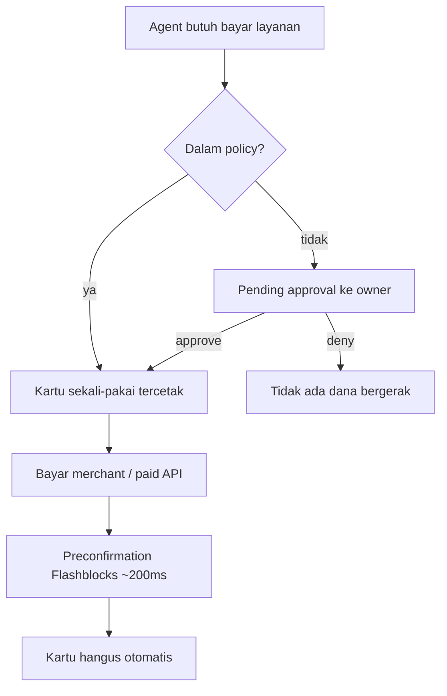

# GiwaCard - Plan

## Goal Capsule

- **Objective:** Memenangkan grant GASOK dengan membangun infrastruktur pembayaran crypto-native untuk AI agent di GIWA Sepolia (chain ID 91342), terinspirasi model agentcard.sh.
- **Product authority:** Lexirieru (owner repo). Arah produk dikonfirmasi 2026-08-01: kartu sekali-pakai onchain + merchant pertama berupa paid API bergaya x402.
- **Open blockers:**
  - Deadline extended GASOK (31 Juli 2026) sudah lewat; halaman belum menyatakan closed. Submit aplikasi secepatnya atau kontak email resmi di halaman gasok.

---

## Product Contract

### Summary

GiwaCard memberi AI agent kemampuan membayar secara aman di GIWA Sepolia: owner mendanai smart account miliknya sendiri, agent mencetak "kartu" sekali-pakai berbatas nominal, scope, dan expiry lewat MCP + skill, dan transaksi di luar policy tertahan sampai owner menyetujui di dashboard. Loop demo ditutup oleh merchant pertama berupa paid API bergaya x402 yang menagih per-request ke kartu tersebut.

### Problem Frame

AI agent makin sering diminta menyelesaikan alur kerja yang berujung pembayaran, tapi memberi agent akses penuh ke dompet adalah risiko yang tidak bisa diterima — satu kesalahan model atau prompt injection bisa menguras dana. agentcard.sh membuktikan solusinya di dunia fiat: kartu virtual sekali-pakai dengan cap, scope, dan approval manusia. Namun produk itu custodial dan sangat US-centric (Visa, Apple Pay, KYC scan wajah, alamat billing hardcoded San Francisco) sehingga tidak bisa dipakai komunitas crypto global.

Di sisi lain, GIWA — L2 OP Stack milik ekosistem Upbit — sedang mencari aplikasi native lewat program GASOK, dan belum ada infrastruktur pembayaran agent apa pun di chain tersebut. Bahan bakunya justru sudah tersedia di genesis: EntryPoint ERC-4337 v0.6/v0.7, Safe, Permit2, preconfirmation Flashblocks ~200ms, dan identitas up.id.

### Key Decisions

- **Non-custodial.** Dana tinggal di smart account milik owner; sistem tidak pernah memegang kunci atau saldo pengguna. Pembeda tajam dari agentcard.sh yang custodial, sekaligus menghapus kebutuhan KYC/compliance di testnet dan menjadi narasi keamanan utama untuk grant.
- **Kartu = otorisasi belanja sekali-pakai onchain.** Terjemahan langsung dari "one-time virtual card": otorisasi dengan cap nominal, scope (token, merchant), dan expiry yang hangus setelah satu charge sukses. Kebocoran kredensial kartu menjadi tidak bernilai.
- **Policy ditegakkan di kontrak, bukan di prompt.** Cap dan scope dienforce onchain sehingga agent yang salah atau disusupi tetap tidak bisa melebihi batas — prompt hanyalah lapisan sopan santun, kontrak adalah lapisan hukum.
- **Consent dua tingkat.** Permintaan di luar policy menghasilkan pending approval yang diputuskan owner (pola 202/approve agentcard.sh); di sisi client, tool sensitif ditahan sampai konfirmasi eksplisit dengan signature call yang sama — meniru pola anti-prompt-injection dari imessage-agent-template.
- **Packaging MCP server + skill.** Skill mengajarkan alur kerja dan aturan keselamatan; MCP server mengeksekusi. Pola onboarding <10 menit dari coding agent mana pun adalah fitur produk, bukan dokumentasi.
- **Merchant pertama dibangun sendiri sebagai paid API bergaya x402.** Menghindari toko simulasi: demo end-to-end menghasilkan nilai nyata (agent membayar per-request untuk sebuah layanan) meski chain masih testnet-only.
- **Testnet-first, sandbox-by-default.** GIWA Sepolia adalah target rilis; mainnet masuk roadmap grant (mainnet GIWA belum live). Meniru pola sandbox-default agentcard.sh.
- **Kontrak upgradeable dan verified.** Semua kontrak inti memakai proxy upgradeable dan diverifikasi di Blockscout (sepolia-explorer.giwa.io) — constraint eksplisit dari owner.
- **Strategi grant dobel track.** Daftar GASOK di track AI/Web3 (utama) dan GIWA-Native (Flashblocks, predeploy 4337, up.id sebagai fitur load-bearing); platform B2B dinarasikan sebagai roadmap Phase 3/4.
- **Dua jalur pemakaian setara: for human dan for agent.** Human memakai CLI interaktif dan dashboard; agent memakai MCP + skill. Kemampuan inti (lihat kartu, approve, cek saldo) tersedia di kedua jalur. CLI adalah surface utama human; dashboard web minimal (approval + status).
- **Stack tunggal TypeScript** untuk semua komponen non-kontrak (MCP SDK v2, viem, CLI berbasis clack + ASCII art); kontrak tetap Foundry/Solidity. `npx giwacard` adalah pintu masuk tunggal.
- **Mekanisme kartu tanpa bundler ERC-4337.** Kartu = otorisasi EIP-712 sekali-pakai (pola Permit2 SignatureTransfer, nonce bitmap non-urut) yang ditegakkan vault escrow onchain; tidak ada dependensi bundler/paymaster. Kompatibilitas 4337 dibawa sebagai roadmap, bukan MVP.
- **Fork kode MIT dari repo referensi agentcard.sh** (MCP server, skill, redaction, pola approval) dengan atribusi copyright dipertahankan; seluruh lapisan onchain ditulis baru.
- **Settlement x402 memakai Permit2 yang sudah predeploy di genesis GIWA**; facilitator self-host menjadi bagian dari paid API demo — tanpa implementasi EIP-3009.
- **MCP server berjalan stdio lokal via npx untuk MVP** — kunci sesi tidak pernah meninggalkan mesin owner; mode remote HTTP menjadi roadmap.
- **State onchain adalah satu-satunya kebenaran.** Used-flag kartu di kontrak menentukan status final; preconfirmation Flashblocks dipakai untuk UX "instan", UI menandai transaksi pending sampai blok safe.
- **Distribusi one-command.** Produk terinstal dari package registry publik dengan satu perintah (mis. `npx giwacard`); CLI-nya adalah pintu masuk onboarding, dengan ASCII art berkualitas tinggi sebagai identitas brand di terminal.

### Actors

- A1. **Owner** — manusia pemilik dana; mendanai smart account, menetapkan policy, menyetujui/menolak permintaan di luar batas.
- A2. **AI agent** — Claude Code / Cursor / Gemini CLI dsb. yang terhubung via MCP; meminta kartu dan membelanjakannya atas nama owner.
- A3. **Merchant** — penerima pembayaran onchain; merchant pertama adalah paid API bergaya x402 yang dioperasikan proyek ini.
- A4. **Dashboard** — surface web owner untuk saldo, kartu, approval, dan riwayat; diposisikan sebagai kandidat integrasi GIWA Wallet.

### Requirements

**Inti onchain**

- R1. Owner memiliki smart account di GIWA Sepolia yang menampung test-stablecoin dan ETH untuk gas.
- R2. Agent dapat meminta penerbitan kartu dengan cap nominal, token, scope merchant, dan expiry.
- R3. Kartu bersifat sekali-pakai: hangus otomatis setelah satu charge sukses dan tidak dapat direplay.
- R3b. Mint kartu meng-escrow cap dari saldo tersedia (saldo tersedia = saldo dikurangi total cap kartu aktif); saat kartu hangus — terpakai, expire, atau dibatalkan — sisa yang tidak ter-charge kembali tersedia otomatis.
- R4. Cap dan scope ditegakkan di level kontrak sehingga tidak dapat dilampaui oleh agent mana pun.
- R5. Permintaan di luar policy menghasilkan pending approval yang hanya bisa diresolve owner; tanpa persetujuan, tidak ada dana bergerak.
- R5b. Pending approval kedaluwarsa otomatis setelah batas waktu ke status terminal yang deterministik, tanpa dana bergerak.
- R6. Semua kontrak inti upgradeable dan terverifikasi di Blockscout GIWA Sepolia.

**Integrasi agent**

- R7. MCP server mengekspos tools untuk agent: mint kartu, lihat status kartu, batalkan kartu, baca saldo, baca policy, dan cek status approval miliknya — resolve approval TIDAK pernah tersedia lewat MCP (khusus owner via dashboard/CLI, selaras R5).
- R8. Skill mendokumentasikan alur kerja, kosakata, dan aturan keselamatan agar agent memakai tools dengan benar.
- R9. Coding agent baru dapat onboard (install MCP + skill sampai kartu pertama) dalam waktu di bawah 10 menit mengikuti runbook yang bisa dieksekusi mesin.
- R10. Material rahasia (kunci sesi, kredensial kartu) tidak pernah masuk konteks model — diredaksi sebelum hasil tool dikembalikan.
- R10b. Charge ke merchant dieksekusi di sisi server atas referensi kartu yang opaque; agent tidak pernah menerima material yang bisa ditandatangani.

**Surface owner**

- R11. Dashboard menampilkan saldo, kartu aktif/hangus, antrean approval, dan riwayat transaksi.
- R12. Owner dapat menyetujui atau menolak pending approval dalam maksimal dua interaksi dari dashboard.
- R13. Alur approval dirancang mandiri dan ringkas sehingga layak diintegrasikan ke GIWA Wallet (kriteria seleksi GASOK).

**Loop demo dan ekosistem**

- R14. Merchant pertama berupa paid API yang menagih per-request lewat kartu dan mengembalikan hasil bernilai nyata.
- R15. Demo end-to-end berjalan dari prompt agent sampai hasil API diterima, dengan konfirmasi terasa instan via Flashblocks.
- R16. Test-stablecoin di-deploy sendiri lengkap dengan faucet-nya (tidak ada test USDC kanonik di GIWA Sepolia).

**Distribusi dan CLI**

- R19. Produk terinstal lewat satu perintah dari package registry publik (mis. `npx giwacard` atau setara di ekosistem stack terpilih).
- R20. CLI interaktif untuk human mencakup onboarding (wizard), cek saldo/kartu, dan resolve approval — dengan ASCII art berkualitas tinggi dan interaksi yang halus sebagai identitas brand.
- R21. Dokumentasi dan entry point terpisah "for human" (CLI + dashboard) dan "for agent" (MCP + skill), dengan kemampuan inti setara di keduanya.

**Deliverable grant**

- R17. Materi aplikasi GASOK memetakan produk ke enam kriteria Phase 1 (kecocokan GIWA, orisinalitas, feasibility, pasar, tim, potensi GIWA Wallet) untuk track AI/Web3 dan GIWA-Native.
- R18. Repo publik dengan README yang mendemonstrasikan alur lengkap dan siap dijadikan bahan video demo.

### Key Flows

- F1. Onboarding owner
  - **Trigger:** Owner baru ingin memakai GiwaCard.
  - **Actors:** A1, A4
  - **Steps:** Jalankan CLI satu perintah → wizard interaktif memandu: hubungkan wallet → siapkan smart account → isi gas dari faucet GIWA dan test-stablecoin dari faucet proyek → pasang MCP + skill di agent → set policy default.
  - **Outcome:** Agent siap membelanjakan dana dalam batas policy.
- F2. Belanja dalam policy
  - **Trigger:** Agent perlu membayar merchant dan nominal berada dalam batas.
  - **Actors:** A2, A3
  - **Steps:** Agent minta kartu → kartu tercetak dengan cap/scope/expiry → agent membayar merchant → preconfirmation instan → kartu hangus.
  - **Covers:** R2, R3, R4, R14, R15
- F3. Approval di luar policy
  - **Trigger:** Permintaan kartu melebihi cap atau di luar scope.
  - **Actors:** A1, A2, A4
  - **Steps:** Permintaan masuk antrean pending → owner menerima konteks lengkap di dashboard → approve/deny → jika approve, kartu tercetak dan alur lanjut seperti F2.
  - **Covers:** R5, R11, R12
- F4. Expiry dan pembatalan
  - **Trigger:** Kartu tidak terpakai sampai expiry, atau owner membatalkan manual.
  - **Actors:** A1
  - **Steps:** Kartu lewat expiry atau dibatalkan → status hangus → dana tetap utuh di smart account.
  - **Covers:** R3, R4

### Acceptance Examples

- AE1. **Covers R2, R3, R14.** Given kartu ber-cap 5 gUSD untuk merchant API, When API menagih 1 gUSD, Then pembayaran sukses, kartu hangus, dan charge kedua pada kartu yang sama ditolak.
- AE2. **Covers R4, R5.** Given policy cap 10 gUSD, When agent meminta kartu 100 gUSD, Then tidak ada kartu tercetak; pending approval muncul di dashboard, dan setelah owner deny, saldo tidak berubah sama sekali.
- AE3. **Covers R3.** Given kartu yang sudah dipakai, When siapa pun mencoba memakai ulang kredensialnya, Then transaksi ditolak di level kontrak.
- AE4. **Covers R10.** Given agent menyelesaikan pembayaran, When transkrip sesi agent diperiksa, Then tidak ada kunci sesi atau kredensial kartu yang muncul di konteks model.

### Success Criteria

- Demo end-to-end (F2 dan F3) berjalan di GIWA Sepolia tanpa intervensi manual di luar approval owner.
- Semua kontrak inti tampil "Verified" di sepolia-explorer.giwa.io.
- Coding agent yang belum pernah melihat proyek ini berhasil onboard sampai kartu pertama dalam <10 menit.
- Aplikasi GASOK tersubmit dengan narasi yang memetakan produk ke keenam kriteria Phase 1.

### Scope Boundaries

**Deferred for later**

- Platform issuing B2B multi-tenant (org menerbitkan kartu untuk agent user mereka) — narasi roadmap grant, bukan MVP.
- Kanal approval di luar dashboard (bot Telegram, email, push).
- Sponsorship gas / paymaster untuk owner tanpa ETH.
- Program rewards (analogi TOKENBACK) dan integrasi up.id yang lebih dalam dari sekadar tampilan nama.
- Deploy mainnet — menunggu GIWA mainnet live.

**Outside this product's identity**

- Rail fiat, kartu Visa, KYC, dan segala bentuk custodial balance.
- Shopping intelligence ala tool `buy` DoorDash — agent membawa niat belanjanya sendiri; produk ini hanya rail pembayarannya.

### Dependencies / Assumptions

- RPC publik GIWA Sepolia rate-limited dan dinyatakan tidak layak production — cukup untuk pengembangan; demo memakai retry/backoff dan RPC cadangan.
- Nama package npm `giwacard` masih tersedia per 1 Agustus 2026 (registry 404) — perlu segera direserve sebelum rilis.
- Repo referensi kunci berlisensi MIT (mcp, agent-card-skill, agentcard-mcp, imessage-agent-template); dua repo tanpa lisensi (gemini-extension, example-implementations) hanya boleh ditiru polanya.
- **Asumsi:** aplikasi GASOK masih bisa disubmit meski deadline extended (31 Juli 2026) lewat — halaman belum menyatakan closed dan menerima aplikasi susulan selama Phase 2. Belum terverifikasi dari pihak GIWA.
- Faucet ETH testnet dibatasi 0.005–0.01 ETH per 24 jam — jumlah wallet demo perlu memperhitungkan ini.
- Klaim "agentcard.sh menang Y Combinator" tidak terverifikasi dari situsnya — jangan dipakai dalam materi aplikasi.

### Outstanding Questions

**Deferred to planning**

- Bentuk test-stablecoin (nama, decimals, mekanik faucet).
- Jenis layanan paid API pertama yang paling demoable.
- Hosting paid API demo (lokal vs hosted publik).

### Sources / Research

- Repo referensi agentcard.sh (lokal, di-gitignore): `references/` pada checkout main — terutama `references/mcp/src/tools/` (pola 202/approval, limit), `references/agent-card-skill/SKILL.md` (kosakata + workflow skill), `references/imessage-agent-template/src/agent/agent.ts` (hold-until-confirm + redaction dua lapis), `references/agentcard-mcp/README.md` (packaging MCP remote + OAuth DCR).
- GASOK: https://giwa.io/gasok — kriteria seleksi, track, struktur grant ($20k + bonus KPI $80k), timeline (Demoday Oktober 2026 di KBW).
- Docs GIWA: https://docs.giwa.io (llms.txt sebagai indeks) — connect-to-giwa (RPC/chain ID), contracts (predeploy 4337/Safe/Permit2, WETH9), flashblocks (~200ms preconfirmation), faucets, panduan Foundry + verifikasi Blockscout, up.id.
- Positioning agentcard.sh: https://www.agentcard.sh/ — "Card issuing for agent-first startups", onboarding 10 menit, MCP out of the box.
