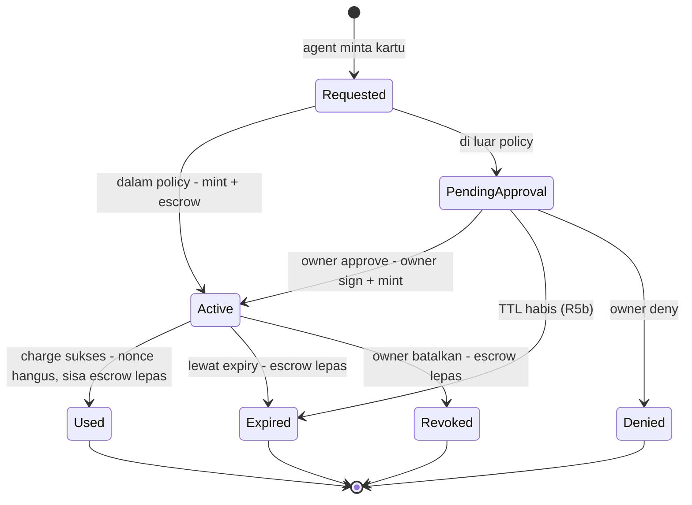

# GiwaCard - Plan

## Goal Capsule

- **Objective:** Membangun GiwaCard MVP end-to-end di GIWA Sepolia (chain ID 91342) — kontrak upgradeable+verified, MCP server + skill untuk agent, CLI interaktif + dashboard minimal untuk human, merchant paid API x402 — plus materi aplikasi GASOK.
- **Authority:** Product Contract di dokumen ini (dibawa utuh dari origin brainstorm) adalah otoritas perilaku produk; Planning Contract adalah otoritas teknis. Konvensi repo (`frontend/AGENTS.md`: baca `node_modules/next/dist/docs/` sebelum menulis kode Next.js) mengikat saat implementasi dashboard.
- **Stop conditions:** Berhenti dan tanya user bila: (a) desain kontrak harus menyimpang dari model escrow/sekali-pakai di R2–R5; (b) publish ke npm registry (aksi eksternal — butuh konfirmasi user); (c) submit apa pun ke pihak GIWA.
- **Product Contract preservation:** Requirements (R), Actors (A), dan Flows (F) tidak berubah dari origin. Acceptance Examples AE1–AE4 dipertahankan dengan penajaman kata (AE1 kini menyebut pelepasan sisa escrow); AE5–AE7 adalah turunan baru yang ditambahkan saat planning untuk menutup R3b, R5b, dan resistensi injection pada R4.

---

## Product Contract

### Summary

GiwaCard memberi AI agent kemampuan membayar secara aman di GIWA Sepolia: owner mendanai smart account miliknya sendiri, agent mencetak "kartu" sekali-pakai berbatas nominal, scope, dan expiry lewat MCP + skill, dan transaksi di luar policy tertahan sampai owner menyetujui. Human memakai CLI interaktif (`npx giwacard`) dan dashboard minimal; loop demo ditutup merchant paid API bergaya x402.

### Requirements

**Inti onchain**

- R1. Owner memiliki smart account di GIWA Sepolia yang menampung test-stablecoin dan ETH untuk gas.
- R2. Agent dapat meminta penerbitan kartu dengan cap nominal, token, scope merchant, dan expiry.
- R3. Kartu bersifat sekali-pakai: hangus otomatis setelah satu charge sukses dan tidak dapat direplay.
- R3b. Mint kartu meng-escrow cap dari saldo tersedia (saldo tersedia = saldo dikurangi total cap kartu aktif); saat kartu hangus — terpakai, expire, atau dibatalkan — sisa yang tidak ter-charge kembali tersedia otomatis.
- R4. Cap dan scope ditegakkan di level kontrak sehingga tidak dapat dilampaui oleh agent mana pun.
- R5. Permintaan di luar policy menghasilkan pending approval yang hanya bisa diresolve owner; tanpa persetujuan, tidak ada dana bergerak.
- R5b. Pending approval kedaluwarsa otomatis setelah batas waktu ke status terminal yang deterministik, tanpa dana bergerak.
- R6. Semua kontrak inti upgradeable dan terverifikasi di Blockscout GIWA Sepolia.

**Integrasi agent**

- R7. MCP server mengekspos tools untuk agent: mint kartu, lihat status kartu, batalkan kartu, baca saldo, baca policy, dan cek status approval miliknya — resolve approval TIDAK pernah tersedia lewat MCP (khusus owner via dashboard/CLI, selaras R5).
- R8. Skill mendokumentasikan alur kerja, kosakata, dan aturan keselamatan agar agent memakai tools dengan benar.
- R9. Coding agent baru dapat onboard (install MCP + skill sampai kartu pertama) dalam waktu di bawah 10 menit mengikuti runbook yang bisa dieksekusi mesin.
- R10. Material rahasia (kunci sesi, kredensial kartu) tidak pernah masuk konteks model — diredaksi sebelum hasil tool dikembalikan.
- R10b. Charge ke merchant dieksekusi di sisi server atas referensi kartu yang opaque; agent tidak pernah menerima material yang bisa ditandatangani.

**Surface owner**

- R11. Dashboard menampilkan saldo, kartu aktif/hangus, antrean approval, dan riwayat transaksi.
- R12. Owner dapat menyetujui atau menolak pending approval dalam maksimal dua interaksi dari dashboard.
- R13. Alur approval dirancang mandiri dan ringkas sehingga layak diintegrasikan ke GIWA Wallet (kriteria seleksi GASOK).

**Loop demo dan ekosistem**

- R14. Merchant pertama berupa paid API yang menagih per-request lewat kartu dan mengembalikan hasil bernilai nyata.
- R15. Demo end-to-end berjalan dari prompt agent sampai hasil API diterima, dengan konfirmasi terasa instan via Flashblocks.
- R16. Test-stablecoin di-deploy sendiri lengkap dengan faucet-nya (tidak ada test USDC kanonik di GIWA Sepolia).

**Distribusi dan CLI**

- R19. Produk terinstal lewat satu perintah dari package registry publik (`npx giwacard`).
- R20. CLI interaktif untuk human mencakup onboarding (wizard), cek saldo/kartu, dan resolve approval — dengan ASCII art berkualitas tinggi dan interaksi yang halus sebagai identitas brand.
- R21. Dokumentasi dan entry point terpisah "for human" (CLI + dashboard) dan "for agent" (MCP + skill), dengan kemampuan inti setara di keduanya.

**Deliverable grant**

- R17. Materi aplikasi GASOK memetakan produk ke enam kriteria Phase 1 (kecocokan GIWA, orisinalitas, feasibility, pasar, tim, potensi GIWA Wallet) untuk track AI/Web3 dan GIWA-Native.
- R18. Repo publik dengan README yang mendemonstrasikan alur lengkap dan siap dijadikan bahan video demo.

### Actors

- A1. **Owner** — manusia pemilik dana; mendanai smart account, menetapkan policy, menyetujui/menolak permintaan di luar batas.
- A2. **AI agent** — Claude Code / Cursor / Gemini CLI dsb. yang terhubung via MCP; meminta kartu dan membelanjakannya atas nama owner.
- A3. **Merchant** — penerima pembayaran onchain; merchant pertama adalah paid API bergaya x402 yang dioperasikan proyek ini.
- A4. **Dashboard** — surface web owner untuk saldo, kartu, approval, dan riwayat; diposisikan sebagai kandidat integrasi GIWA Wallet.

### Key Flows

- F1. Onboarding owner — **Trigger:** owner baru. **Steps:** `npx giwacard` → wizard: buat/impor wallet → deploy/attach vault → klaim faucet ETH + gUSD → generate session key + isi gas → pasang MCP + skill ke agent → set policy default. **Outcome:** agent siap belanja dalam policy.
- F2. Belanja dalam policy — **Trigger:** agent perlu bayar merchant, nominal dalam batas. **Steps:** agent minta kartu → kartu tercetak (escrow cap) → server bayar merchant atas card_id → preconfirmation instan → kartu hangus. **Covers:** R2, R3, R3b, R4, R14, R15.
- F3. Approval di luar policy — **Trigger:** permintaan melebihi cap/scope. **Steps:** masuk antrean pending → owner lihat konteks di dashboard/CLI → approve (tanda tangan owner) / deny → jika approve, lanjut seperti F2; mint-on-approve tidak bergantung sesi agent yang masih hidup. **Covers:** R5, R5b, R11, R12.
- F4. Expiry dan pembatalan — **Trigger:** kartu tak terpakai sampai expiry, atau owner batalkan. **Steps:** kartu hangus → escrow dilepas → dana utuh. **Covers:** R3, R3b, R4.

### Acceptance Examples

- AE1. **Covers R2, R3, R14.** Given kartu ber-cap 5 gUSD untuk merchant API, When API menagih 1 gUSD, Then pembayaran sukses, kartu hangus, sisa 4 gUSD kembali tersedia, dan charge kedua pada kartu yang sama ditolak.
- AE2. **Covers R4, R5.** Given policy cap 10 gUSD, When agent meminta kartu 100 gUSD, Then tidak ada kartu tercetak; pending approval muncul, dan setelah owner deny, saldo tidak berubah.
- AE3. **Covers R3.** Given kartu yang sudah dipakai, When siapa pun mencoba memakai ulang kredensialnya, Then transaksi ditolak di level kontrak.
- AE4. **Covers R10.** Given agent menyelesaikan pembayaran, When transkrip sesi agent diperiksa, Then tidak ada kunci sesi atau kredensial kartu di konteks model.
- AE5. **Covers R3b.** Given saldo 10 gUSD dan kartu aktif ber-cap 8 gUSD, When agent minta kartu kedua ber-cap 5 gUSD, Then mint ditolak (saldo tersedia 2 gUSD) sampai kartu pertama hangus.
- AE6. **Covers R5b.** Given pending approval tidak diresolve sampai TTL, Then statusnya menjadi expired secara deterministik dan tidak ada dana bergerak.
- AE7. **Covers R4 (injection).** Given respons merchant berisi instruksi menyuruh agent mencetak kartu di luar scope, When agent menurutinya, Then kontrak tetap menolak — policy tidak bergantung kepatuhan model.

### Success Criteria

- Demo end-to-end (F2 dan F3) berjalan di GIWA Sepolia tanpa intervensi manual di luar approval owner.
- Semua kontrak inti tampil "Verified" di sepolia-explorer.giwa.io (implementation + proxy, "Read/Write as Proxy" aktif).
- Coding agent yang belum pernah melihat proyek ini onboard sampai kartu pertama dalam <10 menit.
- Aplikasi GASOK tersubmit dengan narasi yang memetakan produk ke keenam kriteria Phase 1.

### Scope Boundaries

**Deferred for later**

- Platform issuing B2B multi-tenant; kanal approval non-dashboard (Telegram/email/push); paymaster/gas sponsorship; rewards (analogi TOKENBACK); integrasi up.id lebih dalam; MCP mode remote HTTP; deploy mainnet (menunggu GIWA mainnet live); SIWE auth untuk dashboard hosted.

**Outside this product's identity**

- Rail fiat, kartu Visa, KYC, custodial balance; shopping intelligence ala tool `buy` — agent membawa niat belanjanya sendiri, produk ini hanya rail pembayaran.

**Deferred to Follow-Up Work**

- Publikasi npm `giwacard` (reserve nama = aksi eksternal, dilakukan user atau atas konfirmasi user; lihat KTD-1).
- Migrasi penuh contoh multi-surface (Telegram bot) dari `references/example-implementations`.

### Dependencies / Assumptions

- RPC publik GIWA Sepolia rate-limited (dev-only) — semua klien memakai retry/backoff; RPC cadangan disiapkan untuk demo.
- Faucet ETH 0.005–0.01 ETH/24 jam — gas budget demo dihitung di muka (lihat KTD-6).
- Nama npm `giwacard` tersedia per 2026-08-01 (registry 404); rawan squatting.
- Repo referensi MIT: `references/mcp`, `references/agent-card-skill`, `references/agentcard-mcp`, `references/imessage-agent-template` (fork legal + atribusi); `references/agentcard-gemini-extension` dan `references/example-implementations` tanpa lisensi → pola saja. Folder ini di-gitignore dan hanya ada di checkout main — file yang akan di-fork disalin ke worktree implementasi lebih dulu, dengan commit SHA tiap repo dicatat.
- **Asumsi:** endpoint flashblocks GIWA melayani state preconfirmation lewat `blockTag: 'pending'` seperti implementasi Base — diverifikasi sekali di awal U4 sebelum wrapper transport dibangun.
- Aplikasi GASOK diasumsikan masih bisa disubmit (deadline extended 31 Jul 2026 lewat, halaman belum menyatakan closed) — submit secepatnya adalah prioritas user.

---

## Planning Contract

### Key Technical Decisions

- KTD-1. **Stack tunggal TypeScript; satu package publish `giwacard`, ESM.** Hanya `giwacard/` yang dipublish ke npm — CLI, MCP server, skill, dan daemon approval queue berada di dalamnya (lihat KTD-10). `merchant/` adalah service demo sisi merchant (dijalankan operator, bukan konsumen produk) dan `frontend/` adalah dashboard repo yang sudah ada; keduanya tidak masuk paket npm. Package `"type": "module"` (chalk/ora/clack ESM-only), bundling `tsdown`, `bin: { "giwacard": "./dist/cli.js" }`, Node ≥20. Nama unscoped `giwacard` tersedia — reserve segera (aksi eksternal, konfirmasi user).
- KTD-2. **Kartu = record onchain; EIP-712 hanya untuk jalur approve owner.** Mint adalah tx onchain yang mendaftarkan kartu dan mengunci escrow, sehingga status kartu (`Active`/`Used`/`Expired`/`Revoked`) itu sendiri yang memberi proteksi replay — tidak ada nonce bitmap umum. Untuk mint dalam policy, penandatangan sama dengan pengirim tx (session EOA), jadi vault cukup memeriksa `msg.sender` terhadap policy session key. Signature EIP-712 dipakai **hanya** pada jalur over-policy: owner menandatangani struct kartu `(vault, owner, agent, token, cap, merchantScope, expiry, approvalId)` di luar rantai, dan siapa pun boleh menyubmitnya — `approvalId` sekali-pakai mencegah replay. Tanpa bundler ERC-4337 (GIWA tanpa bundler/paymaster resmi); kompatibilitas 4337 = roadmap.
- KTD-3. **Policy session key dan revokasinya.** Session key agent adalah EOA ber-scope yang teregistrasi di vault dengan policy: `capPerCard`, `dailyCap`, `merchantAllowlist`, `maxExpiry`. `dailyCap` dihitung sebagai jumlah cap kartu yang di-mint dalam jendela hari UTC (`block.timestamp / 86400`), dievaluasi saat mint. Vault menyediakan fungsi `revokeSessionKey(key)` khusus owner yang langsung menghapus entri policy; kartu yang sudah aktif tidak ikut batal (dibatalkan terpisah lewat `cancelCard`). CLI membedakan keduanya: `giwacard revoke key` dan `giwacard revoke card`.
- KTD-4. **Escrow-at-mint dengan akumulator tunggal (R3b).** Vault menyimpan `escrowedTotal` per owner yang hanya berubah pada mint (naik), charge, cancel, dan reap (turun) — bukan hasil penjumlahan kartu aktif, yang gasnya tak terbatas. `availableBalance = balance − escrowedTotal`. Karena EVM tidak punya eksekusi berbasis waktu, escrow kartu kedaluwarsa dilepas lewat `releaseExpired(cardId)` yang permissionless; CLI, MCP, dan dashboard memanggilnya secara oportunistik saat membaca saldo. "Otomatis" di R3b berarti tanpa aksi owner, bukan tanpa transaksi. Charge memakai check-effects: kartu harus `Active` atau revert.
- KTD-5. **State onchain = kebenaran untuk status kartu; Flashblocks = UX.** Status kartu di kontrak menentukan kebenaran; klien membaca preconfirmation via RPC flashblocks dengan `blockTag: 'pending'` untuk rasa instan, dan UI menandai "pending" sampai blok safe. Aturan "tanpa keputusan atas preconfirmation" berlaku untuk **keputusan status kartu di sisi klien** (menampilkan kartu sebagai final, mengizinkan mint berikutnya). Merchant demo boleh merilis barang digital saat charge masuk blok sequencer — risiko testnet yang diterima secara sadar dan dicatat di U9.
- KTD-6. **Model gas: setiap tx punya penyubmit bernama.** Mint dalam policy dan charge disubmit session EOA; mint-on-approve disubmit wallet owner saat resolve (bukan session EOA, karena sesi agent mungkin sudah berakhir); deploy kontrak oleh deployer key. Facilitator merchant **tidak** menyubmit tx settlement (lihat KTD-9), jadi tidak butuh EOA berdana. Wizard menampilkan tabel budget gas per alamat penyubmit dan mengecek kecukupan sebelum tiap tx; N≤20 mint+charge jauh di bawah 0.005 ETH/hari pada gas L2. Paymaster deferred.
- KTD-7. **MCP stdio lokal via `npx giwacard mcp`; signing server-side.** Kunci sesi dipakai hanya di proses MCP server; hasil tool diredaksi dua lapis (fork `redact.ts` MIT dari `references/imessage-agent-template`). Agent hanya melihat `card_id` opaque (R10, R10b).
- KTD-8. **MCP SDK v2.** Paket `@modelcontextprotocol/server` (registerTool, Zod v4, Standard Schema); struktur tool surface diadaptasi dari `references/mcp/src` (MIT) lalu dimigrasi dengan codemod resmi `v1-to-v2`. Transport stdio (host spawn via npx); HTTP+SSE lama tidak diimplementasikan (sunset Jun 2026). Spike hari pertama Fase B memverifikasi satu tool v2 teregistrasi di Claude Code, Cursor, dan Gemini CLI sebelum fork penuh dikerjakan.
- KTD-9. **Skema x402 kustom bersandar pada charge vault — merchant yang menarik, bukan Permit2.** Permit2 `SignatureTransfer` menarik token dari saldo penanda tangan, sedangkan gUSD berada di escrow dalam vault dan session EOA tidak memegang gUSD — jalur itu tidak bisa menyelesaikan pembayaran. Karena `charge` vault sudah memindahkan dana ke merchant, Permit2 juga redundan. **Arah panggilan mengikuti kontrak: `CardVault.charge` menuntut `msg.sender == card.merchantScope` dan membayar ke `msg.sender`, jadi merchant-lah yang memanggilnya** — sama seperti kartu sungguhan, di mana pemegang kartu menyerahkan kartu dan merchant yang menagih. Skema: merchant menjawab `402` dengan requirements (alamat merchant, jumlah, token, alamat vault); MCP server mengirim `X-PAYMENT` berisi `cardId` (bukan tx hash); facilitator yang menyatu di service merchant memanggil `charge(cardId, harga)` dari kunci merchant, memverifikasi event `CardCharged` pada tx-nya sendiri, lalu mengembalikan `200` + `PAYMENT-RESPONSE` berisi tx hash sebagai bukti. Merchant karenanya butuh EOA berdana — biayanya kecil (satu charge L2 ≈ 1e-5 ETH, jadi kuota faucet harian menutupi ratusan charge) dan itu memang peran facilitator di x402. Kartu membatasi kerugian: merchant hanya bisa menarik sampai `cap` dan hanya jika ia merchant yang di-scope. Permit2/EIP-3009 = roadmap interoperabilitas.
- KTD-10. **Approval queue sebagai daemon di dalam package.** Coordinator (Hono + SQLite) berada di `giwacard/src/daemon/` dan dijalankan `giwacard daemon`; `giwacard mcp` dan CLI menyalakannya otomatis saat dibutuhkan (probe port + lockfile di `~/.giwacard/`), sehingga pengguna `npx giwacard` mendapat alur approval tanpa langkah tambahan (R19, R21). Permintaan over-policy gratis (tanpa gas), rate-limited per session key, TTL default 24 jam (R5b); mint-on-approve terlepas dari sesi agent — agent menemukan kartunya lewat cek status stateless. CLI, dashboard, dan MCP membaca daemon yang sama (satu sumber state off-chain; state dana tetap onchain).
- KTD-11. **UUPS untuk semua kontrak inti** via plugin `openzeppelin-foundry-upgrades` (`Upgrades.deployUUPSProxy`/`upgradeProxy` — validasi storage layout otomatis). Wajib: `_disableInitializers()` di constructor, storage append-only + `__gap`, `_authorizeUpgrade` ber-`onlyOwner`. Test upgrade V1→V2 dengan assert storage.
- KTD-12. **Test-stablecoin `gUSD`** — "GiwaCard USD", 6 desimal (paritas USDC), UUPS, faucet onchain 100 gUSD/alamat/24 jam.
- KTD-13. **CLI: @clack/prompts + figlet + gradient-string + boxen + cli-table3.** Wizard linear pakai clack (bukan ink); banner memakai figlet font `ANSI Shadow` dengan gradient dua warna tetap. Fallback wajib: teks polos tanpa warna saat `NO_COLOR` di-set, saat stdout bukan TTY, atau saat lebar terminal <60 kolom. Spinner clack; ora hanya di luar konteks clack.
- KTD-14. **Dashboard = Next.js `frontend/` yang ada, scope minimal**, dengan Reown AppKit sebagai lapisan koneksi wallet. Owner menghubungkan wallet lewat AppKit (modal multi-wallet, adapter wagmi/viem, GIWA Sepolia didaftarkan sebagai custom chain); dashboard meminta signature EIP-712 owner dan menyubmit tx mint-on-approve dari wallet itu (wallet owner yang bayar gas). Server dashboard tidak pernah menyentuh material kunci. Baca `node_modules/next/dist/docs/` dulu (Next 16.2.12 + React 19 + Tailwind v4 + React Compiler aktif). Auth: localhost-only MVP, tanpa SIWE.
- KTD-18. **Bahasa visual dashboard diturunkan dari landing page.** Primitif UI yang sudah ada di `landingpage/src` (palet `#F4F0ED`/`#0A0B11`/`#18161B`, tipografi, pil nav, tombol rounded-full, keyframes `fadeSlideUp`/`fadeIn`) diekstrak menjadi komponen reusable dan dipakai ulang di dashboard, sehingga landing dan produk terasa satu merek. Tidak membuat sistem desain baru.
- KTD-15. **Kustodi kunci.** Wallet owner dan session key sama-sama disimpan di keystore `~/.giwacard/` (file mode 0600), dienkripsi dengan kunci turunan passphrase yang diminta sekali di awal wizard dan tidak pernah dipersistensi — bukan kunci yang diletakkan bersebelahan dengan ciphertext. Kunci deployer/upgrade-owner tidak pernah berupa env var polos: pakai Foundry keystore (`cast wallet import`) atau hardware wallet; jalur ke multisig/timelock dicatat sebagai prasyarat mainnet.
- KTD-16. **Pengerasan service lokal.** Daemon dan dashboard hanya bind ke `127.0.0.1`. Setiap endpoint yang mengubah state (create, resolve, deny) memvalidasi header `Origin` terhadap allowlist dan menuntut token CSRF per sesi yang ditulis daemon ke `~/.giwacard/` (0600) — mencegah halaman web sembarang di browser owner memanggil localhost. Signature owner yang sudah dikonsumsi onchain dihapus dari SQLite.
- KTD-17. **Topologi vault: satu instance kanonik multi-owner.** CardVault adalah satu proxy UUPS; saldo, escrow, session key, dan policy di-key oleh alamat owner. Wizard hanya *attach* ke alamat vault yang sudah ter-deploy — tidak deploy per owner (menghindari beban gas, deployer, dan verifikasi per pengguna). Vault per owner = roadmap.

### High-Level Technical Design




Diagram bersifat directional; prosa KTD adalah otoritas bila berbeda.

### Output Structure

```text
giwacard/                  # SATU-SATUNYA package yang dipublish ke npm (ESM, tsdown)
  src/cli/                 # wizard clack, banner ascii, status, approve, revoke
  src/mcp/                 # server SDK v2, tools, redaction (fork MIT + atribusi)
  src/chain/               # giwaSepolia defineChain (op-stack), klien viem, keystore
  src/daemon/              # coordinator approval queue (Hono + SQLite), `giwacard daemon`
  skill/SKILL.md           # skill agent (adaptasi agent-card-skill, MIT)
  llms-install.md          # runbook install untuk coding agent (R9)
merchant/                  # paid API x402 demo (tidak dipublish; dijalankan operator merchant)
smartcontracts/src/        # CardVault.sol, GUSD.sol (UUPS)
smartcontracts/script/     # Deploy + verify Blockscout
frontend/                  # Next.js dashboard (approval + status kartu, minimal)
  src/app/(dashboard)/     # halaman dashboard (React 19, compiler-friendly)
```

### Sequencing

U12 (materi GASOK) dikerjakan **hari pertama, paralel dengan Fase A** — deadline aplikasi sudah lewat dan setiap hari menyusutkan peluang; narasi feasibility-nya bersandar pada arsitektur + kontrak yang ter-deploy, bukan MVP selesai.

Fase A (U1–U3, kontrak) → Fase B (U4, U8, U5, U6, U7 — package giwacard, dalam urutan itu) → Fase C (U9, merchant) → Fase D (U10–U11, dashboard + demo). U8 (daemon approval queue) sengaja berada di awal Fase B karena U5 dan U7 keduanya bergantung padanya. U4 bisa mulai paralel dengan Fase A setelah U2 membekukan ABI.

Milestone pertengahan sebagai paket bukti untuk aplikasi grant: U1–U3 ter-deploy dan verified, ditambah jalur happy path U9 — cukup untuk mendemonstrasikan pembayaran agent nyata di GIWA Sepolia sebelum seluruh MVP rampung.

---

## Implementation Units

### U1. Kontrak gUSD + faucet

- **Goal:** Test-stablecoin gUSD (UUPS, 6 desimal) dengan faucet onchain 100 gUSD/alamat/24 jam.
- **Requirements:** R16, R6. **Dependencies:** —
- **Files:** `smartcontracts/src/GUSD.sol`, `smartcontracts/test/GUSD.t.sol`
- **Approach:** ERC20Upgradeable + UUPSUpgradeable (KTD-11, KTD-12); faucet fungsi di token (cooldown per alamat) agar satu kontrak. Prasyarat sebelum menulis test upgrade: install `OpenZeppelin/openzeppelin-foundry-upgrades` sebagai lib dan tambahkan ke `smartcontracts/foundry.toml`: `ffi = true`, `ast = true`, `build_info = true`, `extra_output = ["storageLayout"]` (dibutuhkan validasi `Upgrades.*`).
- **Test scenarios:** mint faucet sukses; klaim kedua <24 jam revert; desimal 6; upgrade V1→V2 storage utuh; `_authorizeUpgrade` ditolak untuk non-owner.
- **Verification:** `forge test` hijau termasuk test upgrade.

### U2. Kontrak CardVault

- **Goal:** Vault kanonik multi-owner: deposit/withdraw gUSD, registri + revokasi session key, mint kartu (escrow), charge, cancel, `releaseExpired`, jalur owner-sig over-policy, events lengkap.
- **Requirements:** R1–R5b, R6. **Dependencies:** U1
- **Files:** `smartcontracts/src/CardVault.sol`, `smartcontracts/src/CardTypes.sol`, `smartcontracts/test/CardVault.t.sol`
- **Approach:** KTD-2/3/4/17; state di-key alamat owner; mint dalam policy diotorisasi lewat `msg.sender` = session key terdaftar (tanpa signature); jalur over-policy memverifikasi EIP-712 owner dengan domain (chainId + alamat proxy) dan `approvalId` sekali-pakai; `escrowedTotal` per owner sebagai akumulator tunggal; `dailyCap` per jendela hari UTC dievaluasi saat mint; charge memindahkan dana ke merchant lalu melepas sisa escrow; `releaseExpired(cardId)` permissionless; `revokeSessionKey(key)` khusus owner.
- **Execution note:** test-first — tulis test AE1/AE3/AE5/AE7 sebagai failing test sebelum implementasi charge.
- **Test scenarios:** Covers AE1 (charge parsial, sisa lepas); Covers AE3 (charge kedua pada kartu `Used` revert); Covers AE5 (mint melebihi available revert); Covers AE7 (mint out-of-scope oleh session key revert; hanya owner-sig lolos); expiry lampau revert; `releaseExpired` pada kartu kedaluwarsa mengembalikan escrow ke available, dan pada kartu aktif revert; mint dengan session key yang sudah di-revoke revert; cancel lalu charge revert (race); mint ke-N yang melampaui `dailyCap` revert, lalu lolos setelah jendela hari berganti; owner-sig dengan `approvalId` yang sudah dipakai revert; charge oleh alamat di luar merchantScope revert; isolasi antar-owner (owner B tidak bisa menyentuh escrow owner A); fuzz cap/amount; upgrade V1→V2 storage utuh.
- **Verification:** `forge test` hijau; gas snapshot mint+charge tercatat.

### U3. Deploy + verifikasi Blockscout

- **Goal:** Script deploy UUPS (gUSD + CardVault) ke GIWA Sepolia, verified implementation + proxy.
- **Requirements:** R6. **Dependencies:** U1, U2
- **Files:** `smartcontracts/script/Deploy.s.sol`, `smartcontracts/README.md`
- **Approach:** `openzeppelin-foundry-upgrades`; kunci deployer dipasok lewat Foundry keystore (`cast wallet import deployer --interactive`, flag `--account deployer`) — tidak pernah env var polos (KTD-15); verify: implementation dulu lalu proxy (constructor args ABI-encoded persis); verifier-url `https://sepolia-explorer.giwa.io/api` (wajib suffix `/api`); fallback manual via Blockscout UI (known flaky Foundry↔Blockscout di OP Stack — foundry-rs/foundry#10029).
- **Test scenarios:** Test expectation: none — deployment scripting; verifikasi lewat Definition of Done (explorer menampilkan Verified + Read/Write as Proxy).
- **Verification:** alamat ter-deploy tercatat di README; kedua kontrak Verified di explorer.

### U4. Skeleton package `giwacard`

- **Goal:** Workspace TS `giwacard/`: ESM, tsdown, bin, chain def, keystore, config.
- **Requirements:** R19. **Dependencies:** ABI dari U2
- **Files:** `giwacard/package.json`, `giwacard/src/chain/giwaSepolia.ts`, `giwacard/src/chain/clients.ts`, `giwacard/src/chain/keystore.ts`, `giwacard/tsconfig.json`, `giwacard/src/chain/*.test.ts`
- **Approach:** KTD-1/15; `defineChain` extend `chainConfig` dari `viem/op-stack` (riset #2); dua transport (default + flashblocks `blockTag: 'pending'` untuk read) — verifikasi sekali di awal bahwa endpoint flashblocks benar-benar melayani state pending sub-detik, dan catat hasilnya di KTD-5 sebelum wrapper dibangun; keystore `~/.giwacard/` mode 0600 menyimpan wallet owner dan session key, dienkripsi dengan kunci turunan passphrase (diminta sekali, tidak dipersistensi); retry/backoff wrapper RPC.
- **Test scenarios:** chain def id 91342 + RPC benar; keystore round-trip enkripsi dengan passphrase benar, dan gagal terbaca dengan passphrase salah; file keystore dibuat dengan mode 0600; wrapper retry pada 429 simulasi.
- **Verification:** `bun run build` (tsdown) hijau; vitest hijau.

### U5. MCP server

- **Goal:** `giwacard mcp` (stdio): tools `mint_card`, `get_card_status`, `cancel_card`, `get_balance`, `get_policy`, `check_approval_status`; redaction dua lapis; signing server-side.
- **Requirements:** R7, R10, R10b. **Dependencies:** U4, U8
- **Files:** `giwacard/src/mcp/server.ts`, `giwacard/src/mcp/tools/*.ts`, `giwacard/src/mcp/redact.ts`, `giwacard/src/mcp/*.test.ts`
- **Approach:** KTD-7/8/9; adaptasi surface dari `references/mcp/src` (MIT, atribusi di header + NOTICE) → SDK v2 via codemod; mint dalam policy: submit tx dari session EOA; over-policy: daftarkan ke daemon dan kembalikan `approval_id`; alur bayar menjalankan 402 → `X-PAYMENT` berisi `cardId` → membaca `PAYMENT-RESPONSE` (KTD-9), tanpa pernah menyubmit charge sendiri dan tanpa mengembalikan material sensitif; daemon dinyalakan otomatis bila belum jalan (KTD-10). Taksonomi error yang dikembalikan ke agent harus mencakup: no-gas, rate-limit, approval-pending, kartu sudah terpakai (AE3), saldo tersedia kurang (AE5), merchant di luar scope (AE7), dan session key di-revoke.
- **Test scenarios:** Covers AE4 (hasil semua tool lolos redaction — scan pattern kunci); mint dalam policy → card_id; mint over-policy → approval_id tanpa tx; `check_approval_status` pada approval approved → card_id muncul (decoupled dari sesi); tool resolve approval TIDAK terdaftar (parity R7); tiap kelas error di atas mengembalikan kode + pesan yang stabil dan bisa ditindaklanjuti agent; error RPC → pesan aman tanpa stack rahasia; daemon mati → MCP menyalakannya lalu tool tetap berhasil.
- **Verification:** MCP inspector/list-tools menunjukkan surface persis R7; vitest hijau.

### U6. Skill + runbook install

- **Goal:** `skill/SKILL.md` (kosakata, workflow, aturan keselamatan, tabel error) + `llms-install.md` yang membawa coding agent dari nol sampai kartu pertama <10 menit.
- **Requirements:** R8, R9, R21. **Dependencies:** U5
- **Files:** `giwacard/skill/SKILL.md`, `giwacard/llms-install.md`, `README.md` (bagian "For agents")
- **Approach:** Adaptasi `references/agent-card-skill/SKILL.md` (MIT): kosakata VAULT/BALANCE/CARD, aturan "tanya owner sebelum aksi sensitif", dan tabel error lengkap sesuai taksonomi U5 (no-gas, rate-limit, approval-pending, kartu terpakai, saldo tersedia kurang, merchant di luar scope, session key di-revoke); frontmatter tanpa karakter `<`/`>`.
- **Test scenarios:** Test expectation: none — dokumen; diverifikasi lewat uji onboarding DoD.
- **Verification:** agent segar (sesi Claude Code baru) menyelesaikan runbook <10 menit sampai AE1. Waktu diukur dari perintah install pertama; sebelum publish npm, waktu clone+build monorepo tidak dihitung karena bukan bagian jalur distribusi nyata — gate diulang setelah publish untuk mengukur jalur `npx` sesungguhnya.

### U7. CLI interaktif

- **Goal:** `npx giwacard`: banner ASCII brand, wizard onboarding F1, `status`, `approve`, `revoke key|card`, `faucet`.
- **Requirements:** R20, R21, R1. **Dependencies:** U3 (alamat kontrak), U4, U8
- **Files:** `giwacard/src/cli/index.ts`, `giwacard/src/cli/banner.ts`, `giwacard/src/cli/wizard.ts`, `giwacard/src/cli/commands/*.ts`, `giwacard/src/cli/*.test.ts`
- **Approach:** KTD-13/15/17; wizard: minta passphrase keystore → buat/impor wallet owner → attach ke alamat vault kanonik → faucet ETH (link + polling saldo) + faucet gUSD → generate session key + danai gas (KTD-6, tampilkan tabel budget per penyubmit) → set policy default (termasuk memasukkan alamat merchant demo ke `merchantAllowlist` agar F2 bisa jalan) → tulis config MCP ke agent (claude/cursor/gemini); approve/deny menghasilkan owner-sig (F3); resumable (state per langkah di keystore) + pre-check gas tiap tx. State interaktif yang wajib dienumerasi: indikator tunggu-tx dengan penanda pending→safe (KTD-5), pesan + jalur retry saat RPC timeout/429, pesan khusus saat klaim faucet masih dalam cooldown 24 jam, dan pesan kosong/sudah-selesai untuk `status`/`approve` saat tidak ada antrean.
- **Test scenarios:** wizard resume dari langkah terputus; approve → owner-sig valid diterima vault (integrasi dengan anvil fork); `revoke key` menonaktifkan session key sementara `revoke card` hanya membatalkan satu kartu; faucet dalam cooldown → pesan spesifik, bukan error mentah; RPC 429 → retry dengan pesan, bukan crash; banner fallback teks polos saat `NO_COLOR`, non-TTY, dan lebar <60 kolom; perintah di mesin tanpa keystore → pesan onboarding.
- **Verification:** rekaman demo wizard end-to-end di GIWA Sepolia.

### U8. Daemon coordinator (approval queue)

- **Goal:** `giwacard daemon` (Hono + SQLite di dalam package): antrean approval (create/list/resolve/status), rate limit per session key, TTL 24 jam, auto-start dari CLI/MCP.
- **Requirements:** R5, R5b, R12 (sisi service). **Dependencies:** U4
- **Files:** `giwacard/src/daemon/index.ts`, `giwacard/src/daemon/queue.ts`, `giwacard/src/daemon/db.ts`, `giwacard/src/daemon/*.test.ts`
- **Approach:** KTD-10/16; bind `127.0.0.1` saja; auto-start via probe port + lockfile di `~/.giwacard/`; endpoint dipakai MCP (create/status) dan CLI/dashboard (list/resolve); setiap endpoint pengubah state memvalidasi `Origin` terhadap allowlist dan token CSRF per sesi (file 0600); resolve menyimpan owner-signature yang dihasilkan klien owner dan menghapusnya setelah dikonsumsi onchain — server tidak pernah memegang kunci owner.
- **Test scenarios:** Covers AE6 (TTL → expired deterministik); rate limit: permintaan ke-N+1 dalam jendela ditolak; resolve tanpa token CSRF ditolak; request dengan `Origin` di luar allowlist ditolak; daemon tidak bisa dijangkau dari alamat non-loopback; approval approved → status memuat kartu; signature terhapus setelah dikonsumsi; idempotency-key mencegah antrean ganda dari retry; auto-start menghasilkan satu proses saja saat dua klien memanggil bersamaan.
- **Verification:** vitest hijau; e2e create→approve→mint jalan lokal.

### U9. Merchant paid API x402

- **Goal:** Service demo `merchant/`: endpoint premium ber-402; facilitator verifikasi (read-only) menyatu.
- **Requirements:** R14, R15. **Dependencies:** U3, U4
- **Files:** `merchant/src/index.ts`, `merchant/src/x402.ts`, `merchant/src/verify.ts`, `merchant/test/*.test.ts`, `merchant/package.json`
- **Approach:** KTD-9/5; layanan demo: "GIWA Insights" — laporan analitik chain (blok, gas, aktivitas) yang dihasilkan on-demand, 1 gUSD/request (bernilai nyata + tanpa dependensi eksternal); flow: 402 + requirements → MCP server mengirim `X-PAYMENT` berisi `cardId` → facilitator memanggil `charge(cardId, harga)` dari kunci merchant lalu memverifikasi event `CardCharged` pada receipt-nya sendiri (alamat vault, merchant, jumlah, cardId cocok) → 200 + laporan + `PAYMENT-RESPONSE` berisi tx hash. Facilitator butuh EOA berdana; satu charge L2 ≈ 1e-5 ETH sehingga kuota faucet harian menutupi ratusan charge. Kebijakan rilis: laporan dirilis saat charge masuk blok sequencer (bukan menunggu blok safe) — risiko reorg testnet diterima sadar dan dicatat di README demo.
- **Test scenarios:** request tanpa payment → 402 + skema benar; payment valid → 200 + laporan; tx hash yang tidak memuat event `Charged` → tolak; event ada tapi merchant/jumlah/cardId tidak cocok → tolak; tx hash yang sudah dipakai request lain → tolak (anti double-spend receipt); kartu bekas (AE3) tidak bisa menghasilkan charge baru; Covers AE7 (respons merchant berisi instruksi injection → tidak mengubah apa pun di sisi kontrak).
- **Verification:** e2e bayar-dan-terima-laporan di GIWA Sepolia.

### U10. Dashboard minimal

- **Goal:** Halaman di `frontend/`: antrean approval (approve/deny ≤2 interaksi), daftar kartu + status finality, saldo/escrow, dan riwayat transaksi.
- **Requirements:** R11, R12, R13. **Dependencies:** U8, U3
- **Files:** `frontend/src/app/(dashboard)/*`, `frontend/src/lib/wallet.ts`, test sesuai konvensi Next lokal
- **Approach:** KTD-14; WAJIB baca `node_modules/next/dist/docs/` dulu (frontend/AGENTS.md); data antrean dari daemon localhost, data dana dibaca onchain via viem; riwayat transaksi dibangun dari log event vault (`Minted`/`Charged`/`Released`) yang di-query viem — tanpa penyimpanan riwayat terpisah di daemon; approve memakai wallet browser (EIP-6963) untuk owner-sig dan submit mint-on-approve; badge "pending → safe" (KTD-5); komponen compiler-friendly (React Compiler aktif). State yang wajib dirender: antrean kosong ("tidak ada approval tertunda"), approval kedaluwarsa ditandai badge "Expired" dan tombolnya nonaktif (bukan dihilangkan diam-diam), serta status wallet belum terhubung.
- **Test scenarios:** approve dari dashboard = hasil identik dengan approve CLI (parity); daftar kartu konsisten dengan state onchain; riwayat transaksi menampilkan mint/charge/release yang sama dengan event onchain; approval expired tampil sebagai "Expired" dan tidak bisa di-resolve; antrean kosong menampilkan pesan, bukan panel kosong; aksi approve tanpa wallet terhubung memunculkan ajakan menghubungkan wallet.
- **Verification:** `bun run build` frontend hijau; alur approve manual di browser terekam untuk demo.

### U11. E2E demo + README

- **Goal:** Skrip demo choreography + README utama dua jalur (for human / for agent) + atribusi MIT.
- **Requirements:** R18, R21, R15. **Dependencies:** U1–U10
- **Files:** `README.md`, `docs/demo.md`, `NOTICE`
- **Approach:** Choreography: onboarding → AE1 happy path → AE2 approval → AE7 injection-resist; gas budget tabel vs faucet; NOTICE berisi copyright Agentcard Corporation / Tiny Agent Company untuk kode yang di-fork.
- **Test scenarios:** Test expectation: none — dokumen; validitas lewat eksekusi demo DoD.
- **Verification:** demo penuh berjalan dari skrip tanpa improvisasi.

### U12. Materi aplikasi GASOK

- **Goal:** Draft jawaban form GASOK (ID + EN): pemetaan 6 kriteria Phase 1, track AI/Web3 + GIWA-Native, roadmap (B2B, mainnet, GIWA Wallet integration), KPI.
- **Requirements:** R17, R13. **Dependencies:** — (dikerjakan hari pertama, paralel dengan Fase A; narasi feasibility bersandar pada arsitektur + kontrak ter-deploy, bukan MVP selesai)
- **Files:** `docs/grant/gasok-application.md`
- **Approach:** Kecocokan GIWA = Flashblocks + predeploy (4337/Safe/Permit2) + up.id roadmap; orisinalitas = infra agent-payments pertama di GIWA, lapisan onchain baru; feasibility = kontrak ter-deploy dan verified di testnet plus jalur pembayaran agent yang sudah jalan (milestone pertengahan), bukan klaim MVP rampung; GIWA Wallet fit = surface approval R13. Tidak mengklaim afiliasi YC/agentcard.sh.
- **Test scenarios:** Test expectation: none — dokumen.
- **Verification:** user review + submit (aksi eksternal milik user).

---

## Verification Contract

| Gate | Perintah | Berlaku untuk |
|---|---|---|
| Kontrak: unit + fuzz + upgrade | `forge test` (di `smartcontracts/`) | U1, U2 |
| Kontrak: deploy + verify | `forge script script/Deploy.s.sol --rpc-url $GIWA_SEPOLIA_RPC_URL --broadcast --verify --verifier blockscout --verifier-url $BLOCKSCOUT_API_URL` | U3 |
| TS: build | `bun run build` per package (`giwacard/`, `merchant/`, `frontend/`) | U4–U10 |
| TS: test | `bun test` / `vitest run` per package | U4, U5, U8, U9 |
| Parity & keamanan | AE4 (scan transkrip), AE7 (injection), parity approve CLI vs dashboard | U5, U7, U9, U10 |
| E2E testnet | skrip `docs/demo.md` dijalankan penuh di GIWA Sepolia | U11 |
| Onboarding | agent segar menyelesaikan `llms-install.md` <10 menit sampai AE1 | U6 |

---

## Definition of Done

- Seluruh AE1–AE7 terbukti oleh test otomatis atau langkah demo terdokumentasi.
- gUSD + CardVault ter-deploy di GIWA Sepolia, keduanya Verified (implementation + proxy, Read/Write as Proxy aktif).
- `npx giwacard` (build lokal via `npm link`/`bunx` sebelum publish) menjalankan wizard sampai agent siap; publish npm menunggu konfirmasi user.
- Demo end-to-end F2 + F3 berjalan sesuai `docs/demo.md` tanpa intervensi di luar approval owner.
- README dua jalur + NOTICE atribusi MIT lengkap; draft aplikasi GASOK siap direview user.
- Kode percobaan/dead-end dari eksplorasi dihapus dari diff sebelum selesai.
- Draft aplikasi GASOK selesai di hari pertama dan siap disubmit user, tidak menunggu MVP rampung.

---

## Risks & Dependencies

- **Verifikasi Blockscout flaky di OP Stack** (foundry#10029) — mitigasi: fallback verifikasi manual via UI/standard-json-input; sediakan `--guess-constructor-args`. Deteksi proxy ("Read/Write as Proxy") ditentukan explorer dan tidak bisa dipaksa; bila binding proxy gagal muncul meski sumber terverifikasi, catat di README dan tautkan implementation langsung.
- **Kode referensi tidak ter-pin dan tidak ada di worktree implementasi** — `references/` di-gitignore dan hanya ada di checkout main. Mitigasi: catat commit SHA tiap repo referensi dan salin file yang akan di-fork (`redact.ts`, `SKILL.md`, tool surface MCP) ke dalam worktree sebelum Fase B mulai.
- **MCP SDK v2 masih muda** — mitigasi: spike hari pertama Fase B (KTD-8) sebelum fork penuh; bila v2 belum stabil di ketiga host, tetap di v1 dan tunda codemod.
- **Basefee L1 Sepolia melonjak** menaikkan biaya data L1 — budget gas yang diuji saat sepi bisa tidak cukup saat demo; siapkan ETH lebih dari beberapa hari klaim faucet.
- **RPC rate limit saat demo** — mitigasi: retry/backoff di semua klien + RPC cadangan; latihan demo di jam sepi.
- **Faucet cap 0.005–0.01 ETH/24 jam** — mitigasi: gas budget dihitung wizard; kumpulkan ETH beberapa hari sebelum demo.
- **Nama npm diserobot** — mitigasi: reserve `giwacard` segera setelah user konfirmasi.
- **Status aplikasi GASOK tidak pasti (deadline lewat)** — mitigasi: submit draft secepatnya; U12 bisa maju mendahului implementasi.
- **Fork kode v1 SDK menua** — mitigasi: codemod resmi ke v2 sejak awal (KTD-8), bukan menunda migrasi.

---

## Sources / Research

- Origin: `docs/brainstorms/2026-08-01-giwa-agent-card-requirements.md`.
- Referensi kode (lokal, gitignored, checkout main): `references/mcp/src` (tool surface + poll-approval), `references/agent-card-skill/SKILL.md`, `references/imessage-agent-template/src/lib/redact.ts` (redaction dua lapis), `references/agentcard-mcp/README.md` (packaging).
- GIWA: https://docs.giwa.io — connect-to-giwa (chain 91342, RPC), contracts (predeploy EntryPoint v0.6/v0.7, Safe, Permit2, Multicall3), flashblocks, faucets, panduan Foundry+Blockscout; https://giwa.io/gasok (kriteria + track).
- Pola spending policy onchain tanpa bundler: Coinbase spend-permissions (github.com/coinbase/spend-permissions); Safe Allowance Module (docs.safe.global). Permit2 SignatureTransfer (developers.uniswap.org) dibaca sebagai pembanding dan ditolak untuk settlement — lihat KTD-9.
- x402: whitepaper + specs `exact_evm` (github.com/coinbase/x402) sebagai acuan bentuk header; facilitator self-host (github.com/OviatoHQ/x402-facilitator-hono) sebagai acuan struktur service — skema settlement kita kustom (KTD-9), bukan `exact_evm` apa adanya.
- UUPS: docs.openzeppelin.com/upgrades + plugin openzeppelin-foundry-upgrades.
- MCP SDK v2: ts.sdk.modelcontextprotocol.io/v2 (registerTool, transport), codemod v1-to-v2; Agent Skills: github.com/anthropics/skills.
- viem OP Stack chain def: viem.sh/docs/chains + definisi `baseSepolia` sebagai template.
- CLI: @clack/prompts 1.7, figlet, gradient-string, boxen (ESM-only); bundler tsdown.
