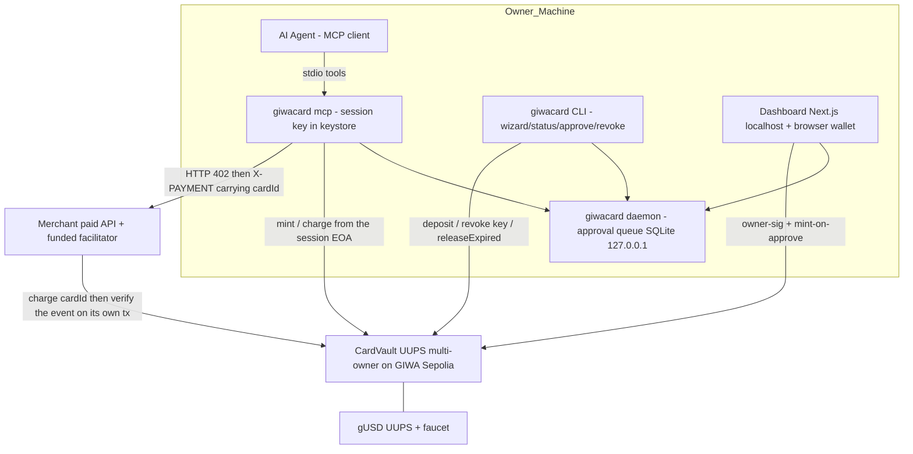
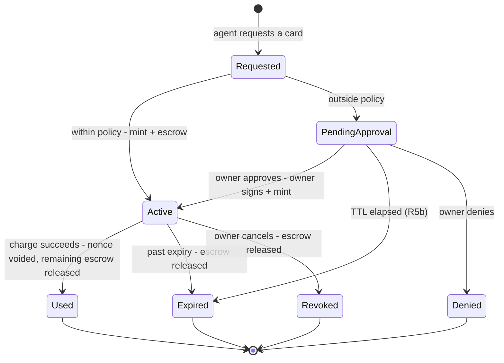

# GiwaCard - Plan

## Goal Capsule

- **Objective:** Build the GiwaCard MVP end-to-end on GIWA Sepolia (chain ID 91342) — upgradeable + verified contracts, an MCP server + skill for agents, an interactive CLI + minimal dashboard for humans, an x402 merchant paid API — plus the GASOK application materials.
- **Authority:** The Product Contract in this document (carried over intact from the origin brainstorm) is the authority on product behaviour; the Planning Contract is the technical authority. Repo conventions (`frontend/AGENTS.md`: read `node_modules/next/dist/docs/` before writing Next.js code) are binding while implementing the dashboard.
- **Stop conditions:** Stop and ask the user if: (a) the contract design has to deviate from the escrow / one-time-use model in R2–R5; (b) publishing to the npm registry (an external action — needs user confirmation); (c) submitting anything to the GIWA team.
- **Product Contract preservation:** Requirements (R), Actors (A), and Flows (F) are unchanged from the origin. Acceptance Examples AE1–AE4 are kept with sharpened wording (AE1 now mentions releasing the remaining escrow); AE5–AE7 are new derivatives added during planning to cover R3b, R5b, and injection resistance on R4.

---

## Product Contract

### Summary

GiwaCard gives AI agents the ability to pay safely on GIWA Sepolia: the vault owner funds their own smart account, the agent mints a one-time-use "card" bounded by a cap, merchant scope, and expiry through MCP + skill, and transactions outside policy are held until the owner approves them. Humans use an interactive CLI (`npx giwacard`) and a minimal dashboard; the demo loop is closed by an x402-style merchant paid API.

### Requirements

**Onchain core**

- R1. The owner has a smart account on GIWA Sepolia that holds test-stablecoin and ETH for gas.
- R2. An agent can request that a card be issued with an amount cap, token, merchant scope, and expiry.
- R3. Cards are one-time-use: a card is voided automatically after one successful charge and cannot be replayed.
- R3b. Minting a card escrows the cap out of the available balance (available balance = balance minus the total cap of active cards); when a card is voided — used, expired, or cancelled — the uncharged remainder becomes available again automatically.
- R4. Cap and scope are enforced at the contract level so that no agent can exceed them.
- R5. A request outside policy produces a pending approval that only the owner can resolve; without approval, no funds move.
- R5b. A pending approval expires automatically after a time limit into a deterministic terminal state, with no funds moving.
- R6. All core contracts are upgradeable and verified on GIWA Sepolia Blockscout.

**Agent integration**

- R7. The MCP server exposes tools to the agent: mint a card, view card status, cancel a card, read balance, read policy, and check the status of its own approvals — resolving an approval is NEVER available over MCP (owner-only, via dashboard/CLI, in line with R5).
- R8. The skill documents the workflow, the vocabulary, and the safety rules so that the agent uses the tools correctly.
- R9. A new coding agent can onboard (install MCP + skill through to its first card) in under 10 minutes by following a machine-executable runbook.
- R10. Secret material (session keys, card credentials) never enters model context — it is redacted before tool results are returned.
- R10b. Charges to a merchant are executed server-side against an opaque card reference; the agent never receives material it could sign with.

**Owner surface**

- R11. The dashboard shows balance, active/voided cards, the approval queue, and transaction history.
- R12. The owner can approve or deny a pending approval in at most two interactions from the dashboard.
- R13. The approval flow is designed to be self-contained and compact, so it is a viable candidate for integration into GIWA Wallet (a GASOK selection criterion).

**Demo loop and ecosystem**

- R14. The first merchant is a paid API that charges per request through a card and returns a genuinely valuable result.
- R15. The end-to-end demo runs from the agent prompt through to the API result being received, with confirmation that feels instant via Flashblocks.
- R16. The test-stablecoin is deployed by us, complete with its own faucet (there is no canonical test USDC on GIWA Sepolia).

**Distribution and CLI**

- R19. The product installs with a single command from a public package registry (`npx giwacard`).
- R20. The interactive CLI for humans covers onboarding (wizard), checking balance/cards, and resolving approvals — with high-quality ASCII art and smooth interactions as brand identity.
- R21. Documentation and entry points are split into "for human" (CLI + dashboard) and "for agent" (MCP + skill), with equivalent core capabilities on both.

**Grant deliverable**

- R17. The GASOK application materials map the product onto the six Phase 1 criteria (GIWA fit, originality, feasibility, market, team, GIWA Wallet potential) for the AI/Web3 and GIWA-Native tracks.
- R18. A public repo with a README that demonstrates the full flow and is ready to serve as demo-video material.

### Actors

- A1. **Owner** — the human who owns the funds; funds the smart account, sets policy, approves/denies requests outside the limits.
- A2. **AI agent** — Claude Code / Cursor / Gemini CLI and the like, connected over MCP; requests cards and spends them on the owner's behalf.
- A3. **Merchant** — the onchain payment recipient; the first merchant is an x402-style paid API operated by this project.
- A4. **Dashboard** — the owner's web surface for balance, cards, approvals, and history; positioned as a GIWA Wallet integration candidate.

### Key Flows

- F1. Owner onboarding — **Trigger:** a new owner. **Steps:** `npx giwacard` → wizard: create/import wallet → deploy/attach vault → claim the ETH + gUSD faucets → generate a session key and fund it for gas → install MCP + skill into the agent → set the default policy. **Outcome:** the agent is ready to spend within policy.
- F2. Spending within policy — **Trigger:** the agent needs to pay a merchant, amount within the limits. **Steps:** agent requests a card → the card is minted (cap escrowed) → the server pays the merchant against card_id → instant preconfirmation → the card is voided. **Covers:** R2, R3, R3b, R4, R14, R15.
- F3. Out-of-policy approval — **Trigger:** a request exceeds the cap/scope. **Steps:** it enters the pending queue → the owner reviews the context in the dashboard/CLI → approve (owner signature) / deny → if approved, continue as in F2; mint-on-approve does not depend on the agent's session still being alive. **Covers:** R5, R5b, R11, R12.
- F4. Expiry and cancellation — **Trigger:** a card goes unused until expiry, or the owner cancels it. **Steps:** the card is voided → the escrow is released → the funds are intact. **Covers:** R3, R3b, R4.

### Acceptance Examples

- AE1. **Covers R2, R3, R14.** Given a card capped at 5 gUSD for the merchant API, When the API charges 1 gUSD, Then the payment succeeds, the card is voided, the remaining 4 gUSD becomes available again, and a second charge on the same card is rejected.
- AE2. **Covers R4, R5.** Given a policy cap of 10 gUSD, When the agent requests a 100 gUSD card, Then no card is minted; a pending approval appears, and after the owner denies it, the balance is unchanged.
- AE3. **Covers R3.** Given an already-used card, When anyone tries to reuse its credentials, Then the transaction is rejected at the contract level.
- AE4. **Covers R10.** Given the agent completes a payment, When the agent's session transcript is inspected, Then there is no session key and no card credential in model context.
- AE5. **Covers R3b.** Given a balance of 10 gUSD and an active card capped at 8 gUSD, When the agent requests a second card capped at 5 gUSD, Then the mint is rejected (available balance is 2 gUSD) until the first card is voided.
- AE6. **Covers R5b.** Given a pending approval is not resolved before its TTL, Then its status becomes expired deterministically and no funds move.
- AE7. **Covers R4 (injection).** Given a merchant response containing instructions telling the agent to mint an out-of-scope card, When the agent complies, Then the contract still rejects it — policy does not depend on model compliance.

### Success Criteria

- The end-to-end demo (F2 and F3) runs on GIWA Sepolia with no manual intervention beyond owner approval.
- All core contracts show as "Verified" on sepolia-explorer.giwa.io (implementation + proxy, with "Read/Write as Proxy" working).
- A coding agent that has never seen this project onboards through to its first card in <10 minutes.
- The GASOK application is submitted with a narrative that maps the product onto all six Phase 1 criteria.

### Scope Boundaries

**Deferred for later**

- A B2B multi-tenant issuing platform; non-dashboard approval channels (Telegram/email/push); paymaster/gas sponsorship; rewards (the TOKENBACK analogue); deeper up.id integration; remote HTTP MCP mode; mainnet deploy (waiting for GIWA mainnet to go live); SIWE auth for the hosted dashboard.

**Outside this product's identity**

- Fiat rails, Visa cards, KYC, custodial balances; shopping intelligence in the style of the `buy` tool — the agent brings its own intent to buy, this product is only the payment rail.

**Deferred to Follow-Up Work**

- Publishing `giwacard` to npm (reserving the name = an external action, done by the user or on the user's confirmation; see KTD-1).
- Full migration of the multi-surface example (Telegram bot) from `references/example-implementations`.

### Dependencies / Assumptions

- The public GIWA Sepolia RPC is rate-limited (dev-only) — every client uses retry/backoff; a backup RPC is prepared for the demo.
- The ETH faucet gives 0.005–0.01 ETH/24 h — the demo gas budget is computed up front (see KTD-6).
- The npm name `giwacard` is available as of 2026-08-01 (registry 404); it is vulnerable to squatting.
- MIT reference repos: `references/mcp`, `references/agent-card-skill`, `references/agentcard-mcp`, `references/imessage-agent-template` (legal to fork + attribution); `references/agentcard-gemini-extension` and `references/example-implementations` carry no licence → patterns only. These folders are gitignored and exist only in the main checkout — the files to be forked are copied into the implementation worktree first, with each repo's commit SHA recorded.
- **Assumption:** the GIWA flashblocks endpoint is assumed to serve preconfirmation state via `blockTag: 'pending'` the way the Base implementation does — verified once at the start of U4, before the transport wrapper is built.
- The GASOK application is assumed to still be submittable (the extended deadline of 31 Jul 2026 has passed, and the page does not yet say closed) — submitting as soon as possible is the user's priority.

---

## Planning Contract

### Key Technical Decisions

- KTD-1. **A single TypeScript stack; one published package, `giwacard`, ESM.** Only `giwacard/` is published to npm — the CLI, the MCP server, the skill, and the approval-queue daemon all live inside it (see KTD-10). `merchant/` is a merchant-side demo service (run by the operator, not by consumers of the product) and `frontend/` is the existing dashboard repo; neither goes into the npm package. The package is `"type": "module"` (chalk/ora/clack are ESM-only), bundled with `tsdown`, `bin: { "giwacard": "./dist/cli.js" }`, Node ≥20. The unscoped name `giwacard` is available — reserve it immediately (an external action, user confirmation).
- KTD-2. **A card is an onchain record; EIP-712 is used only for the owner-approve path.** A mint is an onchain tx that registers the card and locks the escrow, so the card status itself (`Active`/`Used`/`Expired`/`Revoked`) is what provides replay protection — there is no general nonce bitmap. For a mint within policy the signer is the same as the tx sender (the session EOA), so the vault only needs to check `msg.sender` against the session key policy. An EIP-712 signature is used **only** on the over-policy path: the owner signs the card struct `(vault, owner, agent, token, cap, merchantScope, expiry, approvalId)` offchain, and anyone may submit it — the one-time-use `approvalId` prevents replay. No ERC-4337 bundler (GIWA has no official bundler/paymaster); 4337 compatibility is roadmap.
- KTD-3. **The session key policy and its revocation.** The agent's session key is a scoped EOA registered in the vault with a policy: `capPerCard`, `dailyCap`, `merchantAllowlist`, `maxExpiry`. `dailyCap` is computed as the sum of the caps of the cards minted within a UTC-day window (`block.timestamp / 86400`), and is evaluated at mint time. The vault exposes an owner-only `revokeSessionKey(key)` that deletes the policy entry immediately; already-active cards are not cancelled along with it (they are cancelled separately via `cancelCard`). The CLI distinguishes the two: `giwacard revoke key` and `giwacard revoke card`.
- KTD-4. **Escrow-at-mint with a single accumulator (R3b).** The vault keeps an `escrowedTotal` per owner that changes only on mint (up), charge, cancel, and reap (down) — it is not a sum over active cards, whose gas cost is unbounded. `availableBalance = balance − escrowedTotal`. Because the EVM has no time-based execution, the escrow on an expired card is released through a permissionless `releaseExpired(cardId)`; the CLI, MCP, and dashboard call it opportunistically whenever they read a balance. "Automatically" in R3b means without owner action, not without a transaction. Charge uses checks-effects: the card must be `Active` or it reverts.
- KTD-5. **Onchain state is the truth for card status; Flashblocks is UX.** The card status in the contract determines the truth; clients read preconfirmations over the flashblocks RPC with `blockTag: 'pending'` for an instant feel, and the UI marks things "pending" until the block is safe. The rule "no decisions on a preconfirmation" applies to **client-side card status decisions** (showing a card as final, allowing the next mint). The demo merchant may release digital goods once the charge lands in a sequencer block — a testnet risk accepted deliberately and recorded in U9.
- KTD-6. **Gas model: every tx has a named submitter.** Mints within policy and charges are submitted by the session EOA; mint-on-approve is submitted by the owner's wallet at resolve time (not by the session EOA, since the agent's session may already be over); contracts are deployed by the deployer key. The merchant facilitator does **not** submit the settlement tx (see KTD-9), so it needs no funded EOA. The wizard shows a gas budget table per submitting address and checks sufficiency before each tx; N≤20 mints+charges is far below 0.005 ETH/day at L2 gas prices. Paymaster deferred.
- KTD-7. **Local MCP over stdio via `npx giwacard mcp`; signing happens server-side.** The session key is used only inside the MCP server process; tool results are redacted in two layers (a fork of the MIT `redact.ts` from `references/imessage-agent-template`). The agent only ever sees an opaque `card_id` (R10, R10b).
- KTD-8. **MCP SDK v2.** The `@modelcontextprotocol/server` package (registerTool, Zod v4, Standard Schema); the tool surface structure is adapted from `references/mcp/src` (MIT) and then migrated with the official `v1-to-v2` codemod. Transport is stdio (the host spawns it via npx); the old HTTP+SSE is not implemented (sunset Jun 2026). A day-one spike in Phase B verifies that a single v2 tool registers in Claude Code, Cursor, and Gemini CLI before the full fork is done.
- KTD-9. **A custom x402 scheme resting on the vault's charge — merchant-pull, not Permit2.** Permit2 `SignatureTransfer` pulls tokens from the signer's balance, whereas gUSD sits in escrow inside the vault and the session EOA holds no gUSD — that path cannot settle the payment. And since the vault's `charge` already moves the funds to the merchant, Permit2 is redundant as well. **The call direction follows the contract: `CardVault.charge` requires `msg.sender == card.merchantScope` and pays out to `msg.sender`, so it is the merchant that calls it** — exactly like a real card, where the cardholder hands over the card and the merchant does the charging. The scheme: the merchant answers `402` with requirements (merchant address, amount, token, vault address); the MCP server sends an `X-PAYMENT` carrying the `cardId` (not a tx hash); the facilitator, colocated in the merchant service, calls `charge(cardId, price)` from the merchant key, verifies the `CardCharged` event on its own tx, then returns `200` + a `PAYMENT-RESPONSE` carrying the tx hash as proof. The merchant therefore needs a funded EOA — the cost is small (one L2 charge ≈ 1e-5 ETH, so the daily faucet quota covers hundreds of charges) and that is precisely the facilitator's role in x402. The card bounds the loss: the merchant can only pull up to `cap`, and only if it is the scoped merchant. Permit2/EIP-3009 = interoperability roadmap.
- KTD-10. **The approval queue is a daemon inside the package.** The coordinator (Hono + SQLite) lives in `giwacard/src/daemon/` and is run by `giwacard daemon`; `giwacard mcp` and the CLI start it automatically when it is needed (port probe + lockfile in `~/.giwacard/`), so an `npx giwacard` user gets the approval flow with no extra steps (R19, R21). Over-policy requests are free (no gas), rate-limited per session key, with a default TTL of 24 hours (R5b); mint-on-approve is decoupled from the agent's session — the agent finds its card through a stateless status check. The CLI, the dashboard, and MCP all read the same daemon (a single source of off-chain state; fund state stays onchain).
- KTD-11. **UUPS for all core contracts** via the `openzeppelin-foundry-upgrades` plugin (`Upgrades.deployUUPSProxy`/`upgradeProxy` — automatic storage layout validation). Mandatory: `_disableInitializers()` in the constructor, append-only storage + `__gap`, and an `onlyOwner` `_authorizeUpgrade`. Test the V1→V2 upgrade with storage assertions.
- KTD-12. **Test-stablecoin `gUSD`** — "GiwaCard USD", 6 decimals (parity with USDC), UUPS, onchain faucet of 100 gUSD/address/24 h.
- KTD-13. **CLI: @clack/prompts + figlet + gradient-string + boxen + cli-table3.** The wizard is linear and uses clack (not ink); the banner uses the figlet `ANSI Shadow` font with a fixed two-colour gradient. Fallbacks are mandatory: plain text with no colour when `NO_COLOR` is set, when stdout is not a TTY, or when the terminal is narrower than 60 columns. Spinners come from clack; ora is used only outside clack context.
- KTD-14. **The dashboard is the existing Next.js `frontend/`, minimal in scope**, with Reown AppKit as the wallet connection layer. The owner connects a wallet through AppKit (multi-wallet modal, wagmi/viem adapter, GIWA Sepolia registered as a custom chain); the dashboard asks for the owner's EIP-712 signature and submits the mint-on-approve tx from that wallet (the owner's wallet pays the gas). The dashboard server never touches key material. Read `node_modules/next/dist/docs/` first (Next 16.2.12 + React 19 + Tailwind v4 + React Compiler enabled). Auth: localhost-only for the MVP, no SIWE.
- KTD-18. **The dashboard's visual language derives from the landing page.** The UI primitives that already exist in `landingpage/src` (the `#F4F0ED`/`#0A0B11`/`#18161B` palette, the typography, the nav pills, the rounded-full buttons, the `fadeSlideUp`/`fadeIn` keyframes) are extracted into reusable components and reused in the dashboard, so that the landing page and the product feel like one brand. No new design system is created.
- KTD-15. **Key custody.** The owner wallet and the session key are both stored in a `~/.giwacard/` keystore (file mode 0600), encrypted with a key derived from a passphrase that is asked for once at the start of the wizard and never persisted — not a key sitting next to its own ciphertext. The deployer/upgrade-owner key is never a plain env var: use a Foundry keystore (`cast wallet import`) or a hardware wallet; the path to a multisig/timelock is recorded as a mainnet prerequisite.
- KTD-16. **Local service hardening.** The daemon and the dashboard bind to `127.0.0.1` only. Every state-changing endpoint (create, resolve, deny) validates the `Origin` header against an allowlist and requires a per-session CSRF token that the daemon writes into `~/.giwacard/` (0600) — this stops any random web page in the owner's browser from calling localhost. Owner signatures that have been consumed onchain are deleted from SQLite.
- KTD-17. **Vault topology: a single canonical multi-owner instance.** CardVault is one UUPS proxy; balances, escrow, session keys, and policy are keyed by owner address. The wizard only *attaches* to an already-deployed vault address — it does not deploy one per owner (which avoids per-user gas, deployer, and verification burden). A vault per owner is roadmap.

### High-Level Technical Design





The diagrams are directional; the KTD prose is the authority where they differ.

### Output Structure

```text
giwacard/                  # the ONLY package published to npm (ESM, tsdown)
  src/cli/                 # clack wizard, ascii banner, status, approve, revoke
  src/mcp/                 # SDK v2 server, tools, redaction (MIT fork + attribution)
  src/chain/               # giwaSepolia defineChain (op-stack), viem clients, keystore
  src/daemon/              # approval queue coordinator (Hono + SQLite), `giwacard daemon`
  skill/SKILL.md           # agent skill (adapted from agent-card-skill, MIT)
  llms-install.md          # install runbook for coding agents (R9)
merchant/                  # x402 paid API demo (not published; run by the merchant operator)
smartcontracts/src/        # CardVault.sol, GUSD.sol (UUPS)
smartcontracts/script/     # Deploy + Blockscout verify
frontend/                  # Next.js dashboard (approval + card status, minimal)
  src/app/(dashboard)/     # dashboard pages (React 19, compiler-friendly)
```

### Sequencing

U12 (the GASOK materials) is done **on day one, in parallel with Phase A** — the application deadline has already passed and every day shrinks the odds; its feasibility narrative rests on the architecture + the deployed contracts, not on a finished MVP.

Phase A (U1–U3, contracts) → Phase B (U4, U8, U5, U6, U7 — the giwacard package, in that order) → Phase C (U9, merchant) → Phase D (U10–U11, dashboard + demo). U8 (the approval-queue daemon) sits early in Phase B deliberately, because U5 and U7 both depend on it. U4 can start in parallel with Phase A once U2 freezes the ABI.

A mid-way milestone serves as the evidence package for the grant application: U1–U3 deployed and verified, plus the U9 happy path — enough to demonstrate a real agent payment on GIWA Sepolia before the whole MVP is finished.

---

## Implementation Units

### U1. gUSD contract + faucet

- **Goal:** A gUSD test-stablecoin (UUPS, 6 decimals) with an onchain faucet of 100 gUSD/address/24 h.
- **Requirements:** R16, R6. **Dependencies:** —
- **Files:** `smartcontracts/src/GUSD.sol`, `smartcontracts/test/GUSD.t.sol`
- **Approach:** ERC20Upgradeable + UUPSUpgradeable (KTD-11, KTD-12); the faucet is a function on the token (per-address cooldown) so that there is only one contract. Prerequisite before writing the upgrade test: install `OpenZeppelin/openzeppelin-foundry-upgrades` as a lib and add to `smartcontracts/foundry.toml`: `ffi = true`, `ast = true`, `build_info = true`, `extra_output = ["storageLayout"]` (required by `Upgrades.*` validation).
- **Test scenarios:** faucet mint succeeds; a second claim <24 h reverts; 6 decimals; V1→V2 upgrade with storage intact; `_authorizeUpgrade` rejected for a non-owner.
- **Verification:** `forge test` green, including the upgrade test.

### U2. CardVault contract

- **Goal:** The canonical multi-owner vault: deposit/withdraw gUSD, session key registry + revocation, card mint (escrow), charge, cancel, `releaseExpired`, the over-policy owner-sig path, and complete events.
- **Requirements:** R1–R5b, R6. **Dependencies:** U1
- **Files:** `smartcontracts/src/CardVault.sol`, `smartcontracts/src/CardTypes.sol`, `smartcontracts/test/CardVault.t.sol`
- **Approach:** KTD-2/3/4/17; state keyed by owner address; a mint within policy is authorised through `msg.sender` = a registered session key (no signature); the over-policy path verifies the owner's EIP-712 signature with the domain (chainId + proxy address) and a one-time-use `approvalId`; `escrowedTotal` per owner as the single accumulator; `dailyCap` per UTC-day window evaluated at mint; charge moves the funds to the merchant and then releases the remaining escrow; `releaseExpired(cardId)` is permissionless; `revokeSessionKey(key)` is owner-only.
- **Execution note:** test-first — write the AE1/AE3/AE5/AE7 tests as failing tests before implementing charge.
- **Test scenarios:** Covers AE1 (partial charge, remainder released); Covers AE3 (a second charge on a `Used` card reverts); Covers AE5 (a mint that exceeds available reverts); Covers AE7 (an out-of-scope mint by the session key reverts; only owner-sig gets through); a past expiry reverts; `releaseExpired` on an expired card returns the escrow to available, and reverts on an active card; a mint with an already-revoked session key reverts; cancel then charge reverts (race); the Nth mint that exceeds `dailyCap` reverts, then goes through once the day window rolls over; an owner-sig with an already-used `approvalId` reverts; a charge from an address outside merchantScope reverts; cross-owner isolation (owner B cannot touch owner A's escrow); fuzz cap/amount; V1→V2 upgrade with storage intact.
- **Verification:** `forge test` green; a gas snapshot of mint+charge recorded.

### U3. Deploy + Blockscout verification

- **Goal:** A UUPS deploy script (gUSD + CardVault) to GIWA Sepolia, with implementation + proxy verified.
- **Requirements:** R6. **Dependencies:** U1, U2
- **Files:** `smartcontracts/script/Deploy.s.sol`, `smartcontracts/README.md`
- **Approach:** `openzeppelin-foundry-upgrades`; the deployer key is supplied through a Foundry keystore (`cast wallet import deployer --interactive`, the `--account deployer` flag) — never a plain env var (KTD-15); verify: implementation first, then the proxy (constructor args ABI-encoded exactly); verifier-url `https://sepolia-explorer.giwa.io/api` (the `/api` suffix is required); manual fallback through the Blockscout UI (known Foundry↔Blockscout flakiness on OP Stack — foundry-rs/foundry#10029).
- **Test scenarios:** Test expectation: none — deployment scripting; verified through the Definition of Done (the explorer shows Verified + Read/Write as Proxy).
- **Verification:** the deployed addresses are recorded in the README; both contracts Verified on the explorer.

### U4. `giwacard` package skeleton

- **Goal:** A `giwacard/` TS workspace: ESM, tsdown, bin, chain def, keystore, config.
- **Requirements:** R19. **Dependencies:** the ABI from U2
- **Files:** `giwacard/package.json`, `giwacard/src/chain/giwaSepolia.ts`, `giwacard/src/chain/clients.ts`, `giwacard/src/chain/keystore.ts`, `giwacard/tsconfig.json`, `giwacard/src/chain/*.test.ts`
- **Approach:** KTD-1/15; `defineChain` extending `chainConfig` from `viem/op-stack` (research #2); two transports (default + flashblocks `blockTag: 'pending'` for reads) — verify once, up front, that the flashblocks endpoint really does serve sub-second pending state, and record the result in KTD-5 before the wrapper is built; the `~/.giwacard/` keystore (mode 0600) holds the owner wallet and the session key, encrypted with a passphrase-derived key (asked for once, never persisted); a retry/backoff RPC wrapper.
- **Test scenarios:** chain def id 91342 + correct RPC; keystore encryption round-trips with the right passphrase, and fails to read with the wrong one; the keystore file is created with mode 0600; the wrapper retries on a simulated 429.
- **Verification:** `bun run build` (tsdown) green; vitest green.

### U5. MCP server

- **Goal:** `giwacard mcp` (stdio): the tools `mint_card`, `get_card_status`, `cancel_card`, `get_balance`, `get_policy`, `check_approval_status`; two-layer redaction; server-side signing.
- **Requirements:** R7, R10, R10b. **Dependencies:** U4, U8
- **Files:** `giwacard/src/mcp/server.ts`, `giwacard/src/mcp/tools/*.ts`, `giwacard/src/mcp/redact.ts`, `giwacard/src/mcp/*.test.ts`
- **Approach:** KTD-7/8/9; adapt the surface from `references/mcp/src` (MIT, attribution in the header + NOTICE) → SDK v2 via codemod; mint within policy: submit the tx from the session EOA; over-policy: register it with the daemon and return an `approval_id`; the payment flow runs 402 → an `X-PAYMENT` carrying the `cardId` → reads `PAYMENT-RESPONSE` (KTD-9), never submitting the charge itself and never returning sensitive material; the daemon is started automatically if it is not already running (KTD-10). The error taxonomy returned to the agent must cover: no-gas, rate-limit, approval-pending, card already used (AE3), insufficient available balance (AE5), merchant out of scope (AE7), and session key revoked.
- **Test scenarios:** Covers AE4 (every tool result passes redaction — key pattern scan); mint within policy → card_id; over-policy mint → approval_id with no tx; `check_approval_status` on an approved approval → card_id appears (decoupled from the session); the resolve-approval tool is NOT registered (R7 parity); each error class above returns a stable code + message the agent can act on; an RPC error → a safe message with no secret stack; the daemon is down → MCP starts it and the tool still succeeds.
- **Verification:** the MCP inspector/list-tools shows exactly the R7 surface; vitest green.

### U6. Skill + install runbook

- **Goal:** `skill/SKILL.md` (vocabulary, workflow, safety rules, error table) + an `llms-install.md` that takes a coding agent from zero to its first card in <10 minutes.
- **Requirements:** R8, R9, R21. **Dependencies:** U5
- **Files:** `giwacard/skill/SKILL.md`, `giwacard/llms-install.md`, `README.md` (the "For agents" section)
- **Approach:** Adapt `references/agent-card-skill/SKILL.md` (MIT): the VAULT/BALANCE/CARD vocabulary, the "ask the owner before sensitive actions" rule, and a complete error table matching the U5 taxonomy (no-gas, rate-limit, approval-pending, card used, insufficient available balance, merchant out of scope, session key revoked); frontmatter with no `<`/`>` characters.
- **Test scenarios:** Test expectation: none — documentation; verified through the DoD onboarding test.
- **Verification:** a fresh agent (a new Claude Code session) completes the runbook in <10 minutes through to AE1. Time is measured from the first install command; before the npm publish, the time to clone+build the monorepo does not count, because it is not part of the real distribution path — the gate is repeated after publishing to measure the actual `npx` path.

### U7. Interactive CLI

- **Goal:** `npx giwacard`: the brand ASCII banner, the F1 onboarding wizard, `status`, `approve`, `revoke key|card`, `faucet`.
- **Requirements:** R20, R21, R1. **Dependencies:** U3 (contract addresses), U4, U8
- **Files:** `giwacard/src/cli/index.ts`, `giwacard/src/cli/banner.ts`, `giwacard/src/cli/wizard.ts`, `giwacard/src/cli/commands/*.ts`, `giwacard/src/cli/*.test.ts`
- **Approach:** KTD-13/15/17; wizard: ask for the keystore passphrase → create/import the owner wallet → attach to the canonical vault address → ETH faucet (link + balance polling) + gUSD faucet → generate a session key and fund it for gas (KTD-6, show the budget table per submitter) → set the default policy (including adding the demo merchant address to `merchantAllowlist` so that F2 can run) → write the MCP config into the agent (claude/cursor/gemini); approve/deny produces the owner-sig (F3); resumable (per-step state in the keystore) + a gas pre-check before each tx. The interactive states that must be enumerated: a tx-wait indicator with a pending→safe marker (KTD-5), a message + retry path on RPC timeout/429, a dedicated message when a faucet claim is still inside its 24-hour cooldown, and empty/already-done messages for `status`/`approve` when there is nothing queued.
- **Test scenarios:** the wizard resumes from an interrupted step; approve → a valid owner-sig is accepted by the vault (integration against an anvil fork); `revoke key` disables the session key while `revoke card` only cancels a single card; faucet in cooldown → a specific message, not a raw error; RPC 429 → retry with a message, not a crash; the banner falls back to plain text under `NO_COLOR`, non-TTY, and widths <60 columns; a command on a machine with no keystore → an onboarding message.
- **Verification:** an end-to-end wizard demo recorded on GIWA Sepolia.

### U8. Coordinator daemon (approval queue)

- **Goal:** `giwacard daemon` (Hono + SQLite inside the package): the approval queue (create/list/resolve/status), a rate limit per session key, a 24-hour TTL, auto-start from the CLI/MCP.
- **Requirements:** R5, R5b, R12 (service side). **Dependencies:** U4
- **Files:** `giwacard/src/daemon/index.ts`, `giwacard/src/daemon/queue.ts`, `giwacard/src/daemon/db.ts`, `giwacard/src/daemon/*.test.ts`
- **Approach:** KTD-10/16; bind to `127.0.0.1` only; auto-start via a port probe + a lockfile in `~/.giwacard/`; the endpoints are used by MCP (create/status) and by the CLI/dashboard (list/resolve); every state-changing endpoint validates `Origin` against an allowlist and a per-session CSRF token (0600 file); resolve stores the owner signature produced by the owner's client and deletes it once it has been consumed onchain — the server never holds the owner's key.
- **Test scenarios:** Covers AE6 (TTL → deterministically expired); rate limit: request N+1 within the window is rejected; a resolve with no CSRF token is rejected; a request with an `Origin` outside the allowlist is rejected; the daemon cannot be reached from a non-loopback address; an approved approval → the status carries the card; the signature is deleted after being consumed; an idempotency key prevents duplicate queue entries from retries; auto-start produces exactly one process when two clients call at the same time.
- **Verification:** vitest green; the create→approve→mint e2e runs locally.

### U9. x402 merchant paid API

- **Goal:** The `merchant/` demo service: a 402-gated premium endpoint; a colocated verification facilitator (read-only).
- **Requirements:** R14, R15. **Dependencies:** U3, U4
- **Files:** `merchant/src/index.ts`, `merchant/src/x402.ts`, `merchant/src/verify.ts`, `merchant/test/*.test.ts`, `merchant/package.json`
- **Approach:** KTD-9/5; the demo service is "GIWA Insights" — a chain analytics report (blocks, gas, activity) generated on demand, 1 gUSD/request (genuinely valuable + no external dependencies); flow: 402 + requirements → the MCP server sends an `X-PAYMENT` carrying the `cardId` → the facilitator calls `charge(cardId, price)` from the merchant key and then verifies the `CardCharged` event on its own receipt (vault address, merchant, amount, cardId all match) → 200 + the report + a `PAYMENT-RESPONSE` carrying the tx hash. The facilitator needs a funded EOA; one L2 charge ≈ 1e-5 ETH, so the daily faucet quota covers hundreds of charges. Release policy: the report is released once the charge lands in a sequencer block (rather than waiting for a safe block) — the testnet reorg risk is accepted deliberately and recorded in the demo README.
- **Test scenarios:** a request with no payment → 402 + the correct schema; a valid payment → 200 + the report; a tx hash that carries no `Charged` event → reject; the event is there but merchant/amount/cardId do not match → reject; a tx hash already used by another request → reject (receipt double-spend guard); a spent card (AE3) cannot produce a new charge; Covers AE7 (a merchant response containing injection instructions → changes nothing on the contract side).
- **Verification:** a pay-and-receive-report e2e on GIWA Sepolia.

### U10. Minimal dashboard

- **Goal:** Pages in `frontend/`: the approval queue (approve/deny in ≤2 interactions), a card list + finality status, balance/escrow, and transaction history.
- **Requirements:** R11, R12, R13. **Dependencies:** U8, U3
- **Files:** `frontend/src/app/(dashboard)/*`, `frontend/src/lib/wallet.ts`, tests per the local Next conventions
- **Approach:** KTD-14; MUST read `node_modules/next/dist/docs/` first (frontend/AGENTS.md); the queue data comes from the localhost daemon, the fund data is read onchain via viem; transaction history is built from the vault's event logs (`Minted`/`Charged`/`Released`) queried with viem — no separate history store in the daemon; approve uses the browser wallet (EIP-6963) for the owner-sig and submits the mint-on-approve; a "pending → safe" badge (KTD-5); compiler-friendly components (React Compiler is enabled). The states that must be rendered: an empty queue ("no pending approvals"), an expired approval marked with an "Expired" badge and its buttons disabled (not silently removed), and a wallet-not-connected state.
- **Test scenarios:** approving from the dashboard = an identical result to approving from the CLI (parity); the card list is consistent with onchain state; transaction history shows the same mint/charge/release as the onchain events; an expired approval shows as "Expired" and cannot be resolved; an empty queue shows a message, not a blank panel; an approve action with no wallet connected prompts the user to connect a wallet.
- **Verification:** `bun run build` green for the frontend; the manual approve flow recorded in the browser for the demo.

### U11. E2E demo + README

- **Goal:** The demo choreography script + the main two-track README (for human / for agent) + MIT attribution.
- **Requirements:** R18, R21, R15. **Dependencies:** U1–U10
- **Files:** `README.md`, `docs/demo.md`, `NOTICE`
- **Approach:** Choreography: onboarding → the AE1 happy path → the AE2 approval → AE7 injection resistance; a gas budget table vs the faucet; NOTICE carries the Agentcard Corporation / Tiny Agent Company copyright for the forked code.
- **Test scenarios:** Test expectation: none — documentation; validity comes from executing the DoD demo.
- **Verification:** the full demo runs from the script with no improvisation.

### U12. GASOK application materials

- **Goal:** A draft of the GASOK form answers (ID + EN): the mapping onto the 6 Phase 1 criteria, the AI/Web3 + GIWA-Native tracks, the roadmap (B2B, mainnet, GIWA Wallet integration), KPIs.
- **Requirements:** R17, R13. **Dependencies:** — (done on day one, in parallel with Phase A; the feasibility narrative rests on the architecture + the deployed contracts, not on a finished MVP)
- **Files:** `docs/grant/gasok-application.md`
- **Approach:** GIWA fit = Flashblocks + predeploys (4337/Safe/Permit2) + the up.id roadmap; originality = the first agent-payments infrastructure on GIWA, a new onchain layer; feasibility = contracts deployed and verified on testnet plus an agent payment path that already works (the mid-way milestone), not a claim that the MVP is finished; GIWA Wallet fit = the R13 approval surface. Claims no affiliation with YC/agentcard.sh.
- **Test scenarios:** Test expectation: none — documentation.
- **Verification:** user review + submit (an external action owned by the user).

---

## Verification Contract

| Gate | Command | Applies to |
|---|---|---|
| Contracts: unit + fuzz + upgrade | `forge test` (in `smartcontracts/`) | U1, U2 |
| Contracts: deploy + verify | `forge script script/Deploy.s.sol --rpc-url $GIWA_SEPOLIA_RPC_URL --broadcast --verify --verifier blockscout --verifier-url $BLOCKSCOUT_API_URL` | U3 |
| TS: build | `bun run build` per package (`giwacard/`, `merchant/`, `frontend/`) | U4–U10 |
| TS: test | `bun test` / `vitest run` per package | U4, U5, U8, U9 |
| Parity & security | AE4 (transcript scan), AE7 (injection), CLI vs dashboard approve parity | U5, U7, U9, U10 |
| Testnet E2E | the `docs/demo.md` script run in full on GIWA Sepolia | U11 |
| Onboarding | a fresh agent completes `llms-install.md` in <10 minutes through to AE1 | U6 |

---

## Definition of Done

- All of AE1–AE7 are proven by an automated test or a documented demo step.
- gUSD + CardVault are deployed on GIWA Sepolia, both Verified (implementation + proxy, Read/Write as Proxy working).
- `npx giwacard` (a local build via `npm link`/`bunx` before publishing) runs the wizard through to the agent being ready; the npm publish waits on user confirmation.
- The F2 + F3 end-to-end demo runs as written in `docs/demo.md`, with no intervention beyond owner approval.
- The two-track README + a complete MIT attribution NOTICE; the GASOK application draft is ready for the user to review.
- Experimental/dead-end code from exploration is removed from the diff before finishing.
- The GASOK application draft is finished on day one and ready for the user to submit, without waiting for the MVP to be complete.

---

## Risks & Dependencies

- **Blockscout verification is flaky on OP Stack** (foundry#10029) — mitigation: fall back to manual verification through the UI/standard-json-input; have `--guess-constructor-args` ready. Proxy detection ("Read/Write as Proxy") is decided by the explorer and cannot be forced; if the proxy binding fails to appear even though the source is verified, note it in the README and link the implementation directly.
- **The reference code is unpinned and absent from the implementation worktree** — `references/` is gitignored and exists only in the main checkout. Mitigation: record each reference repo's commit SHA and copy the files to be forked (`redact.ts`, `SKILL.md`, the MCP tool surface) into the worktree before Phase B starts.
- **MCP SDK v2 is still young** — mitigation: a day-one spike in Phase B (KTD-8) before the full fork; if v2 is not yet stable across all three hosts, stay on v1 and postpone the codemod.
- **An L1 Sepolia basefee spike** raises L1 data costs — a gas budget tested during a quiet period may not be enough during the demo; stock up more ETH from several days of faucet claims.
- **RPC rate limiting during the demo** — mitigation: retry/backoff in every client + a backup RPC; rehearse the demo during quiet hours.
- **The 0.005–0.01 ETH/24 h faucet cap** — mitigation: the wizard computes the gas budget; accumulate ETH over several days before the demo.
- **The npm name gets taken** — mitigation: reserve `giwacard` as soon as the user confirms.
- **The GASOK application status is uncertain (the deadline has passed)** — mitigation: submit the draft as soon as possible; U12 can run ahead of implementation.
- **The forked v1 SDK code ages** — mitigation: run the official codemod to v2 from the start (KTD-8) rather than postponing the migration.

---

## Sources / Research

- Origin: `docs/brainstorms/2026-08-01-giwa-agent-card-requirements.md`.
- Code references (local, gitignored, main checkout): `references/mcp/src` (tool surface + poll-approval), `references/agent-card-skill/SKILL.md`, `references/imessage-agent-template/src/lib/redact.ts` (two-layer redaction), `references/agentcard-mcp/README.md` (packaging).
- GIWA: https://docs.giwa.io — connect-to-giwa (chain 91342, RPC), contracts (predeployed EntryPoint v0.6/v0.7, Safe, Permit2, Multicall3), flashblocks, faucets, the Foundry+Blockscout guide; https://giwa.io/gasok (criteria + tracks).
- Onchain spending policy patterns without a bundler: Coinbase spend-permissions (github.com/coinbase/spend-permissions); the Safe Allowance Module (docs.safe.global). Permit2 SignatureTransfer (developers.uniswap.org) was read as a comparison and rejected for settlement — see KTD-9.
- x402: the whitepaper + the `exact_evm` specs (github.com/coinbase/x402) as the reference for header shape; a self-hosted facilitator (github.com/OviatoHQ/x402-facilitator-hono) as the reference for service structure — our settlement scheme is custom (KTD-9), not `exact_evm` as-is.
- UUPS: docs.openzeppelin.com/upgrades + the openzeppelin-foundry-upgrades plugin.
- MCP SDK v2: ts.sdk.modelcontextprotocol.io/v2 (registerTool, transport), the v1-to-v2 codemod; Agent Skills: github.com/anthropics/skills.
- viem OP Stack chain def: viem.sh/docs/chains + the `baseSepolia` definition as a template.
- CLI: @clack/prompts 1.7, figlet, gradient-string, boxen (ESM-only); tsdown bundler.
